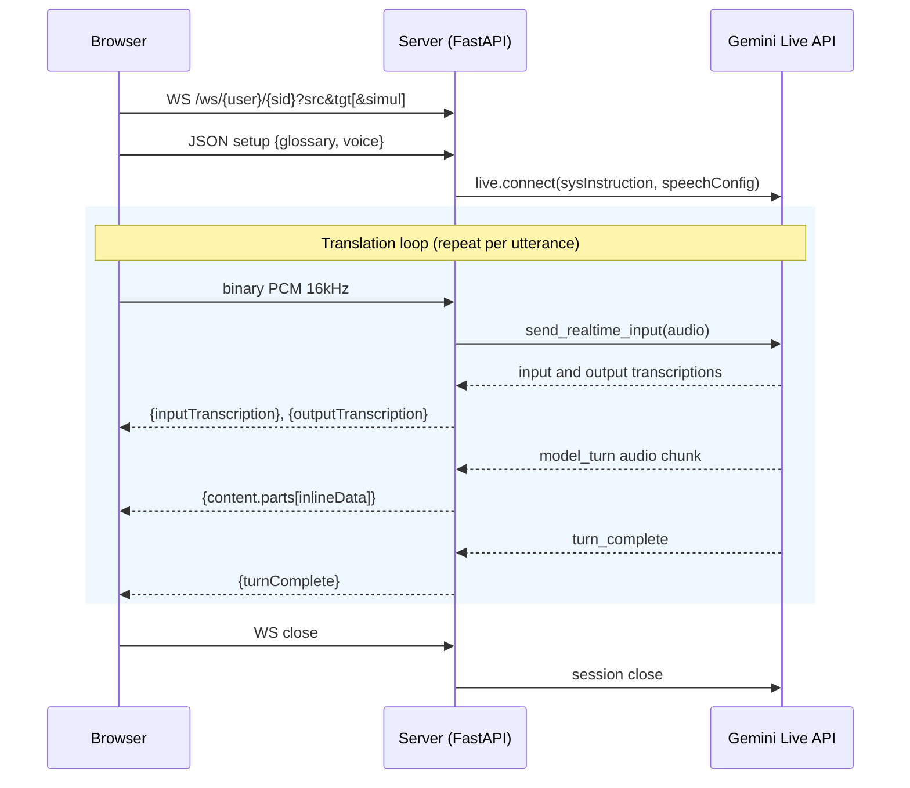
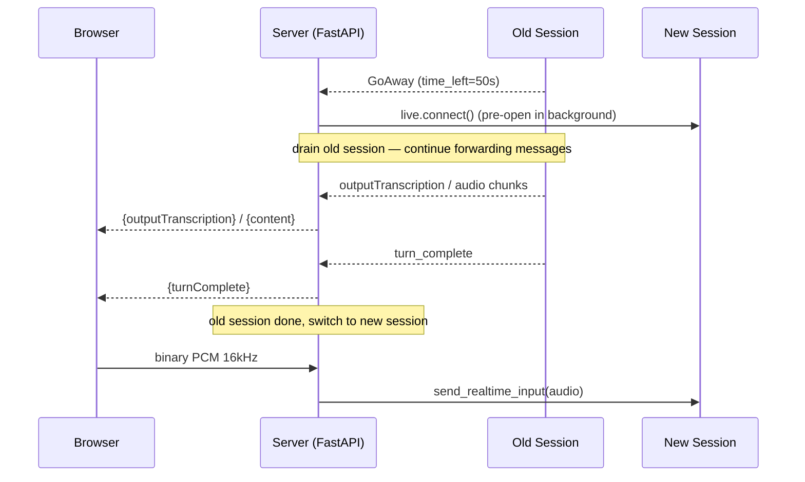
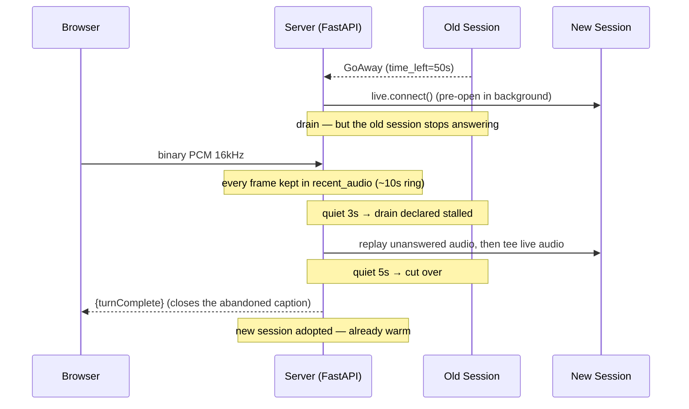

# Live Translator

Real-time audio translation powered by Gemini Live API. Speak in any language and hear the translation immediately. The default is **conversation mode**: a bidirectional interpreter between the two selected languages (97 languages, glossary), so two people can talk to each other. Toggling **Simul** switches to simultaneous translation mode (78 languages, auto-detect source language, one-way into the target).


## Getting Started

### Prerequisites

- Python 3.10+
- [uv](https://docs.astral.sh/uv/) package manager
- [Gemini API key](https://aistudio.google.com/apikey)

### Setup

```bash
uv sync
```

Create `app/.env` with your API key:

```
GOOGLE_API_KEY=your-api-key
```

### Run

```bash
uv run uvicorn app.main:app --reload
```

Open http://localhost:8000.

## User Guide

### Basic Usage

1. Pick your two languages at the bottom of the screen.
2. Click **Start**, and allow microphone access when the browser asks.
3. Talk. What you said appears as text, and the translation is spoken aloud.

Once you are running, **Start** turns into **Mute**. Muting stops sending your voice but keeps the microphone ready, so unmuting is instant and the browser won't ask for permission again.

### Conversation (default)

Two people, two languages, one session. Say something in either of the languages you picked and the app speaks it in the other one. With English and Japanese selected, English comes out as Japanese and Japanese comes out as English — you never tell it who is talking, it works that out from what it hears.

Good for a two-way meeting, an interview, or a conversation at a booth.

- Both language dropdowns stay visible — choose the pair you want to interpret between.
- Your glossary applies in both directions.
- One voice speaks both sides of the conversation.

### Simultaneous Translation

Switch on **Simul** for one-way translation: whatever the microphone hears, in whatever language, comes out in the single language you choose. There is no source language to set, so that dropdown disappears.

Good for a talk, a lecture, or a presentation — one speaker, an audience that needs one language.

Compared with conversation mode:
- **Nothing to configure but the output language** — it works out what is being spoken.
- **78 languages** to choose from, rather than 97.
- **The glossary doesn't steer the translation**, though your on-screen term substitutions still apply.
- **Captions settle a moment later.** This mode doesn't signal where a sentence ends, so text is finalized after about two seconds of quiet.

Switching **Simul** back off returns you to conversation mode, and your language choices carry over.

### Push to Talk

Reach for this when the app is hearing more than you want it to — a noisy room or a busy booth, other conversations nearby, or [echo and feedback](#echo-and-feedback) from your speakers. The microphone only listens while you hold the button down, so background noise and the app's own voice never reach it between your turns.

Toggle **Push to Talk** on the right to switch from always-on to manual control. Hold the **Hold to Talk** button (or press spacebar) to transmit, release to stop.

### Voice & Audio Settings

Click **Voice & Audio** in the header to choose your microphone, your speaker, and the **voice** that reads the translation — 30 to pick from, each labelled with its character (`Kore — Firm`, `Sulafat — Warm`). All three are remembered by your browser.

Microphone and speaker changes take effect straight away. Changing the voice restarts the session, which clears the transcript.

The app remembers every microphone and speaker you have chosen, in order of preference, and always uses the best one currently plugged in. Unplug your headset mid-session and it drops to your next favourite rather than to whatever the system picks. Plug it back in and it takes over again. Choosing **System Default** clears the list — that is read as "stop managing this for me".

### Glossary

Click **Glossary** in the header to pin specific terms to fixed translations — product names, jargon, anything the model tends to get creative with. Your glossary is saved in your browser and applies only to you.

Upload a UTF-8 CSV with `source,target[,transcription]` per line:

```csv
Kubernetes,クバネティス,Kubernetes
Cloud Run,クラウドラン,Cloud Run
Vertex AI,バーテックスエーアイ,Vertex AI
```

The third column is optional and only changes what you see: the app *says* the second form and *shows* the third. That is useful for product names where you want a phonetic pronunciation but a normal spelling on screen.

Changes take effect next time the session starts — click **Start** again, or change a language.

### Caption Overlay

Put translated subtitles on top of any window — useful for presenting at an event, or for screen sharing on Google Meet. Click **Caption** in the header, or go to `/caption`.


1. Open the main app in Chrome and click **Start** to begin translating
2. Click **Caption** in the header — a new window opens with a "Select Window" button
3. Click **Select Window** and pick the window to mirror (your slides, Keynote, any app)
4. That window's content appears in the caption page, with translated subtitles along the bottom
5. Click **⛶ Fullscreen** in the top-right (or press **F**, or double-click) to fill the screen
6. Share this caption window on Google Meet — participants see your slides with live subtitles

Fullscreen is a separate click from *Select Window* on purpose; the two can't be combined for browser security reasons. The button appears once mirroring starts and fades after 4 seconds so it stays off your slides — move the mouse to bring it back. **Esc** exits, as does stopping the screen share.

Both windows have to be in the same browser, and it must be Chrome. No OBS or other tools are needed.

### Connection States

The dot in the top-right corner shows:
- **Yellow / Connecting…** — establishing the connection
- **Green / Connected** — ready to translate
- **Red / Disconnected** — connection lost; it retries automatically after 5 seconds

### Echo and Feedback

**If you are on a phone, tablet, or laptop using its own built-in microphone and speakers, you can skip this section.** Your device cancels its own echo, and the app leaves that switched on. The same goes for headphones or an ordinary headset.

You may run into echo if you are doing any of the following:

- Sending sound to a speaker other than **System Default** in Voice & Audio
- Using external speakers, a PA system, or a mixing desk
- Playing the translation on one device and picking it up with another
- Working in a large or echoey room, or with a distant speaker

In those setups the translation comes out of the speakers, the microphone hears it, and the app treats its own voice as something new to translate — so it starts talking to itself. It won't build into a squeal the way a PA system does. It keeps going at normal volume, one full sentence at a time, which is harder to notice and harder to stop.

The app pushes back on this in several ways ([how](#echo-handling)), but they only go so far. If you hear an echo, try these in order:

1. **Put on headphones.** This breaks the loop at the source and always works.
2. **Set the speaker back to System Default** in Voice & Audio. Sending audio anywhere else switches off the browser's echo cancellation — this is the most common cause of bad echo.
3. **Turn the volume down**, or move the microphone further from the speakers.
4. **Mute** while the translation is playing.

Playing the translation through a PA system, a mixing desk, or a second computer defeats echo cancellation completely, because the sound never goes through this browser. In those setups headphones or a close-up microphone aren't optional.

---

## Technical Details

### Sequence Diagram



FastAPI bridges one browser WebSocket to a series of Gemini Live API sessions. The browser WS lives for the lifetime of the user's tab; upstream Live sessions are opened, expire (~15 min), and reopened underneath it transparently.

**Connection lifecycle:**

1. Browser opens WebSocket to `/ws/{user_id}/{session_id}` and sends a JSON setup frame with the per-browser glossary
2. Server builds a system instruction embedding the glossary and language pair
3. Two background coroutines run concurrently:
   - **session_loop** opens a Gemini Live session, drains messages from it, and forwards them as JSON envelopes to the browser
   - **upstream_task** forwards binary audio frames from the browser WS to whichever upstream session is current
4. When the upstream session sends a GoAway (observed `time_left=50s`), the server immediately starts opening the next session in the background while continuing to drain the current one — this eliminates dead time between sessions
5. Once the old session finishes, the pre-opened session takes over seamlessly

**Wire format:** Each `LiveServerMessage` is translated into a camelCase JSON envelope the frontend understands (`turnComplete`, `inputTranscription`, `outputTranscription`, `content.parts[]`, `usageMetadata`).

**Transcription behavior:** Output transcription (the translated speech) streams in multiple partial chunks, so the UI can show word-by-word updates with a typing indicator. Input transcription (the user's spoken words) arrives as a single message with the complete text — the API does not stream partial input transcriptions, so the user's bubble appears all at once.

### Models

**Agent mode** uses `gemini-3.1-flash-live-preview` via the Gemini API (`generativelanguage.googleapis.com`). The system instruction (built in `app/translator_agent/agent.py`) tells the model to translate only the current utterance and never repeat previous translations. The glossary is embedded as `source → target` pairs with case-insensitive matching.

**Simultaneous translation mode** uses `gemini-3.5-live-translate-preview` with a `TranslationConfig` instead of system instructions. The config specifies `target_language_code` and `echo_target_language=False` (see [Echo Handling](#echo-handling)). This model auto-detects the source language and does not support tools, glossary, or system instructions.

**Conversation mode** (the UI default) reuses the agent model (`gemini-3.1-flash-live-preview`) but with a bidirectional interpreter system instruction (`build_conversation_instruction` in `app/translator_agent/agent.py`): it tells the model to detect which of the two configured languages each utterance is in and reply in the other. The WebSocket carries a `convo=true` query param; the glossary is embedded bidirectionally (`source ↔ target`). Without that param the server falls back to one-way agent mode (`build_system_instruction`), which the UI no longer requests but the test harness still exercises.

Audio input is 16 kHz mono PCM; output is 24 kHz PCM (both modes).

### Echo Handling

Translated speech is played out loud, so any setup where the speakers reach the microphone closes a loop. It is worse than ordinary PA howl in one respect: each round trip is a fresh, fully-formed sentence rather than a resonant frequency, so it needs no gain margin to sustain and can run indefinitely at conversational volume. Three defences act in sequence.

**1. Browser echo cancellation (AEC).** `app/static/js/audio-recorder.js` requests `echoCancellation: true` and `noiseSuppression: true` explicitly rather than relying on the spec default, which is `true` in every browser targeted today but is not ours to depend on. AEC runs inside the browser's input-processing stage, before `createMediaStreamSource` and before the app sees a sample: it knows what was sent to the output device and subtracts that from the microphone signal. `autoGainControl` is deliberately **off** — it flattens the speaker's dynamics, and the system instruction asks the model to preserve tone and urgency.

**2. Simul mode — `echo_target_language=False`.** The translation model accepts no system instruction, so a prompt-level guard is unavailable there; this config flag is the only echo control it has. It tells the model to stay silent on input already in the target language. That matters because the model's own output is, by construction, in the target language — with `True` the model parroted its own echo straight back out, giving a loop with gain ≈ 1 and no natural decay. The tradeoff is that a human genuinely speaking the target language gets no audio out, which is the desired behaviour for one-way translation anyway. Google's own docs also note that `True` introduces artifacts from background noise and music.

**3. Conversation and agent modes — `_ECHO_GUARD`.** Both system-instruction builders in `app/translator_agent/agent.py` end with a paragraph asking the model to stay silent when an utterance is its own earlier output coming back. This is a hint, not a rule: the model has no ground truth for what it emitted, its false-positive mode silently drops a real utterance, and it cannot reliably break a loop already in progress.

**Where AEC stops working.** These are the setups that echo badly:

- **Output routed to a non-default device.** Picking a speaker other than the system default calls `setSinkId`, but the canceller's reference signal is tied to the default output. It ends up subtracting audio nobody is playing, so cancellation is effectively off. This is the most common cause of heavy echo here.
- **A PA system, external mixer, or second machine playing the audio.** The sound never passes through this browser's output path, so there is no reference signal to subtract. Nothing in the stack can help.
- **Acoustic delay beyond the filter tail.** AEC models a finite tail, typically ~100–250 ms. A large room, a distant speaker, or a Bluetooth output whose latency exceeds that puts the echo outside the window the canceller can match.
- **Double-talk.** When someone speaks over the playback, cancellers throttle back to avoid chewing up the near-end voice, and more echo leaks through.

### Audio Devices and Voices

Microphone and speaker choices build a **priority list** rather than a single setting, stored in `localStorage` under `live-translator.audio.inputPriority` / `outputPriority`. Each device picked moves to the top of its list (up to 10 remembered), and the app uses the highest-ranked device actually attached. On `devicechange` the list is re-evaluated and the running pipeline switches mid-session, so losing the mic in use drops to the next favourite instead of the system default. Picking a device also restarts the recorder or player immediately — persisting alone left the pipeline reading the old device until a reload. Choosing **System Default** is a deliberate opt-out and clears the list.

Each entry stores **both `deviceId` and label**. A `deviceId` is perishable — the browser re-salts it when site permissions are cleared, and some devices return with a new one after a replug — so if the saved id no longer resolves, the device is matched by name and the stored id is repaired in place, keeping its rank. Entries for absent devices are retained, so plugging one back in reclaims its position.

The voice is part of the Live session's config, so changing it requires a reconnect (which clears the transcript); microphone and speaker changes do not. Unknown voice names sent by a client are rejected server-side and fall back to `Puck`, since the Live API refuses to connect on an unrecognised voice.

Language selections survive a mode switch: codes are mapped between the two language sets in both directions (e.g. `zh` ↔ `zh-Hans`, `iw` ↔ `he`, `pt` ↔ `pt-BR`).

### Caption Overlay Internals

The caption page uses the [Screen Capture API](https://developer.mozilla.org/en-US/docs/Web/API/Screen_Capture_API) to mirror the target window and the [BroadcastChannel API](https://developer.mozilla.org/en-US/docs/Web/API/BroadcastChannel) to receive transcription from the main page, so both pages must run in the same browser. No OBS or third-party tools needed.

Fullscreen needs its own click, separate from *Select Window*: `requestFullscreen()` consumes the transient user activation that `getDisplayMedia()` also requires, and the window picker preempts an in-flight fullscreen transition. Hence the dedicated button, which appears once mirroring starts and fades out after 4 seconds.

### Changing the Default Glossary

Edit `app/dict.csv` and redeploy. The glossary is per-browser (`localStorage`) and sent to the server on each new session, so browsers with a cached glossary keep using it until the user clicks **Reset to defaults** in the modal.

### GoAway Handling

Gemini Live sessions do not last indefinitely. In 30-minute soaks a GoAway arrived every ~9 minutes, always with `time_left=50s`. When the server receives one:



1. A new session starts opening immediately in the background (`_open_next()`), ready in ~200ms
2. The old session continues draining — any in-progress translation completes and is forwarded to the browser
3. After the old session ends, the pre-opened session becomes the active session
4. Audio from the browser is routed to the new session with no gap

A drain that never finishes its turn is the awkward case: waiting out the whole 50s deadline is dead air the listener hears in full. Two thresholds bound it, both measured from the last frame actually forwarded to the browser (heartbeats don't count, so a turn genuinely in flight is never clipped):



5. At `DRAIN_MIRROR_QUIET_SEC` (3s of quiet) the drain is treated as stalled and the microphone is teed into the replacement as well — speech going into a session that has stopped answering still reaches one that hasn't
6. At `GOAWAY_IDLE_GRACE_SEC` (5s of quiet) the swap happens, instead of waiting out the deadline. The abandoned turn will never report itself complete, so the server sends a synthetic `turnComplete` to close the caption the client left open
7. If a mirrored drain recovers and completes its turn after all, the replacement is discarded and a fresh one opened — it heard audio the old session went on to answer, so keeping it would mean translating the same words twice

What gets replayed into a replacement is decided by one rule: **the audio captured since the outgoing session last said anything.** Nothing was relayed after that point, so none of it has been translated, and anything older has been — replaying that too would translate the same words twice. `recent_audio` keeps every mic frame with its arrival time for ~10s so the cut can be made at that boundary rather than at a fixed offset.

This also covers the case the thresholds alone miss: a GoAway that lands mid-sentence on a session that had already been quiet for longer than the grace. The cutover then happens within milliseconds and the mirror never attaches, but the sentence so far is still owed to the replacement, and is handed to it the moment it is adopted.

**What it costs the listener.** Across 11 GoAways observed in soak testing (two 30-minute local runs and one 1-hour Cloud Run run), a GoAway takes one of four paths:

| Path | Observed | Effect |
|---|---|---|
| Old session finishes its turn | — | none — the swap happens between turns, mic audio keeps flowing to the dying session throughout |
| Drain stalls, then recovers and completes its turn | 5 | none to the listener. The mirrored replacement heard audio the old session went on to answer, so it is discarded and a fresh one opened (~190ms, off the critical path) |
| Drain stalls and never recovers | 3 | up to 5s before the translation lands, and only in a window where nothing was being delivered anyway. All three landed between utterances with no audio owed. The mirror means the replacement has been working on that audio for the last 2s, so it flushes shortly after the swap rather than starting cold |
| GoAway lands mid-sentence on an already-quiet session | 3 | cutover in 2–4ms, the sentence so far (1.4–3.5s of audio) replayed 83–197ms later. All three iterations scored 10/10 at normal latency. Before the replay was added, all but the last word of that sentence was lost |

The soak speaks one sentence every ~17s with quiet gaps in between, which biases heavily towards the stalled paths — continuous speech keeps the drain talking and takes the first row far more often than these counts suggest.

The speaker never has to pause or repeat — every frame is captured regardless of which session is live. On the two cutover paths the seam is visible rather than audible: the synthetic `turnComplete` closes the caption the abandoned turn left open, and the replacement's translation of the same audio appears as a new caption below it.

**Watch out for turn accounting.** The synthetic `turnComplete` is a turn boundary with no turn behind it. Anything pairing utterances 1:1 with turn boundaries over a long-lived socket will sit one turn behind for the rest of the connection once a cutover happens — the soak test did exactly this and reported 68% while translation itself was perfect. `tests/test_long.py` now flushes frames belonging to a turn it gave up on and rejects a boundary with no content in front of it; the browser client is unaffected because `finalizeTurn()` on an already-closed caption is a no-op.

**Limitations:**

- The model on the new session has no context from the previous one, so it starts fresh. The replay covers the audio, not the history.
- On the cutover paths, mic audio arriving between the cutover and the adoption of the replacement (83–197ms observed) is still dropped: `pending_preroll` is captured as bytes at cutover, so frames landing during the wait are not in it. Capturing the cut timestamp instead and building the replay at adoption would close this.

Session resumption was intentionally removed — it caused an off-by-one translation cascade where the model would prepend the previous turn's translation to the current one. Without resumption, each session starts clean, which proved more reliable (98% pass rate vs 65% with resumption in 1-hour soak tests).

### Gemini Live API Transient Errors and Recovery

The Gemini Live API occasionally returns `1011 (service currently unavailable)` errors. Before the recovery fix, production logs showed ~20 errors per 24 hours in two patterns:

- **Mid-session kill** (~65% of cases): An active session is disconnected during `session.receive()`. The session was working, then Gemini drops it.
- **Connect-time rejection** (~35% of cases): Gemini refuses to open a new session entirely. This typically follows a mid-session kill — the retry fails because Gemini is still recovering.

These errors cascaded: a mid-session kill triggered a retry with a flat 1s delay, which was often also rejected because Gemini was still unavailable. The session connect call had no timeout, so it could hang indefinitely on unresponsive connections.

**Recovery logic in `session_loop`:**

1. **Connect timeout** (`CONNECT_TIMEOUT_SEC = 10`): The `conn.__aenter__()` call has a hard timeout so a hanging connect fails fast instead of blocking indefinitely.
2. **Exponential backoff**: Retries start at 0.2s and double on each consecutive failure, capping at 4s. The backoff resets after a successful session. This avoids thrashing the API while still recovering quickly from transient blips.
3. **Transparent reconnect**: The browser WebSocket stays open during retries — only the upstream Gemini session is affected. Once a new session opens, `upstream_task` resumes forwarding audio to it automatically.
4. **No deadlock on the retry path**: `next_ready` is set only by the GoAway pre-open. Waiting on it when no open is in flight — after a session error, say — parked the loop forever, so the wait is gated on an `open_pending` flag and the error path clears it. This showed up in production as the app going unresponsive until the browser reconnected.

After the fix, production logs showed 1 error in 15 hours (vs ~12 in the same period before), with zero connect-time rejections — the faster initial retry reconnects before the cascading failure pattern kicks in.

For real users streaming from a microphone, recovery is seamless — the new session picks up the live audio stream with a brief gap. For health checks that send a one-shot audio clip, the clip may be lost if the session dies before producing a response.

### SDK Note

`app/main.py` clears `GOOGLE_GENAI_USE_VERTEXAI`, `GOOGLE_CLOUD_PROJECT`, and `GOOGLE_CLOUD_LOCATION` before constructing the genai client. These env vars cause the SDK to route through `aiplatform.googleapis.com`; clearing them forces Gemini API key routing via `generativelanguage.googleapis.com`.

### Deployment to Cloud Run

```bash
set -a && source app/.env && set +a

gcloud run deploy live-translation \
  --source . \
  --project YOUR_PROJECT \
  --region us-central1 \
  --allow-unauthenticated \
  --timeout 3600 \
  --min-instances 1 \
  --max-instances 1 \
  --set-env-vars "GOOGLE_API_KEY=${GOOGLE_API_KEY}"
```

Key flags:
- `--timeout 3600` — allows hour-long WebSocket conversations (upstream Live sessions cycle internally every ~15 min)
- `--min-instances 1` — avoids cold start latency
- `--max-instances 1` — session resumption handles are stored in-memory; multi-replica requires a shared store (e.g. Redis)

## Testing

### Soak Test

`tests/test_long.py` validates translation quality, latency, glossary behavior, and session stability over extended periods (default 1 hour).

It generates random English sentences via Gemini Flash Lite, converts them to audio with Google Cloud TTS, streams them through the translator WebSocket, transcribes the returned audio with Google Cloud STT, and verifies semantic correctness.

```bash
uv sync --extra test

# 2-minute smoke test against local server
uv run python tests/test_long.py --duration 120

# 1-hour test against Cloud Run
uv run python tests/test_long.py --url wss://YOUR_CLOUD_RUN_URL --duration 3600
```

Options: `--url` (WebSocket base URL), `--duration` (seconds), `--source`/`--target` (language pair), `--mode` (`convo`, the app default, or `agent` for the one-way path), `--log` (JSONL output path).

#### Latest soak test results (1 hour, en → ja, Cloud Run)

Recorded in **agent mode**, before conversation mode became the default and before the echo guard was added to the system instruction. A 150-second convo-mode smoke run scored 9/9 at avg 10.0/10 with 0 errors, but a full-hour convo-mode soak has not been run.

Six GoAways at a ~9-minute cadence, covering all three drain paths: two instant cutovers that replayed unanswered audio (84,992 and 44,032 bytes, delivered 93ms and 83ms after the GoAway), two stalled drains that recovered and had their mirrored replacement discarded, and two silent cutovers between utterances with nothing owed. Every iteration spanning one scored 10/10 at normal latency. The single failure is the last iteration, truncated by the duration limit.

```
Duration: 3633s | Iterations: 207 | Passed: 206/207 (99.5%) | Avg score: 9.9/10 | Errors: 0

  Translation Score (n=207)
  min=6.00  avg=9.90  p50=10.00  p90=10.00  p99=10.00  max=10.00
         0-2:    0 (  0.0%) 
         3-4:    0 (  0.0%) 
         5-6:    1 (  0.5%) 
         7-8:    3 (  1.4%) 
        9-10:  203 ( 98.1%) ##############################

  Glossary Iteration Score (n=69)
  min=6.00  avg=9.90  p50=10.00  p90=10.00  p99=10.00  max=10.00
         0-2:    0 (  0.0%) 
         3-4:    0 (  0.0%) 
         5-6:    1 (  1.4%) 
         7-8:    1 (  1.4%) 
        9-10:   67 ( 97.1%) ##############################

  First Response (speech-end to first audio/transcript) (n=207)
  min=0.00  avg=0.02  p50=0.00  p90=0.07  p99=0.41  max=0.51
         =0s:  142 ( 68.6%) ##############################
      0-0.1s:   52 ( 25.1%) ##########
    0.1-0.5s:   12 (  5.8%) ##
      0.5-1s:    1 (  0.5%) 
        1-2s:    0 (  0.0%) 
        2-5s:    0 (  0.0%) 
         >5s:    0 (  0.0%) 

  Turn Complete (speech-end to full translation) (n=206)
  min=3.39  avg=5.21  p50=5.21  p90=6.14  p99=7.11  max=7.18
         <2s:    0 (  0.0%) 
        2-3s:    0 (  0.0%) 
        3-4s:   12 (  5.8%) ##
        4-5s:   65 ( 31.6%) ###############
        5-7s:  126 ( 61.2%) ##############################
       7-10s:    3 (  1.5%) 
        >10s:    0 (  0.0%) 

  Input Transcription Score (n=207)
  min=4.00  avg=9.94  p50=10.00  p90=10.00  p99=10.00  max=10.00
         0-2:    0 (  0.0%) 
         3-4:    1 (  0.5%) 
         5-6:    0 (  0.0%) 
         7-8:    0 (  0.0%) 
        9-10:  206 ( 99.5%) ##############################

  Output Transcription Score (n=207)
  min=4.00  avg=9.56  p50=10.00  p90=10.00  p99=10.00  max=10.00
         0-2:    0 (  0.0%) 
         3-4:    1 (  0.5%) 
         5-6:    4 (  1.9%) 
         7-8:   20 (  9.7%) ###
        9-10:  182 ( 87.9%) ##############################

  Total Iteration Time (n=207)
  min=13.68  avg=17.55  p50=17.38  p90=19.37  p99=21.03  max=45.33
        <10s:    0 (  0.0%) 
      10-15s:   10 (  4.8%) #
      15-20s:  184 ( 88.9%) ##############################
      20-25s:   12 (  5.8%) #
      25-30s:    0 (  0.0%) 
        >30s:    1 (  0.5%)
```

