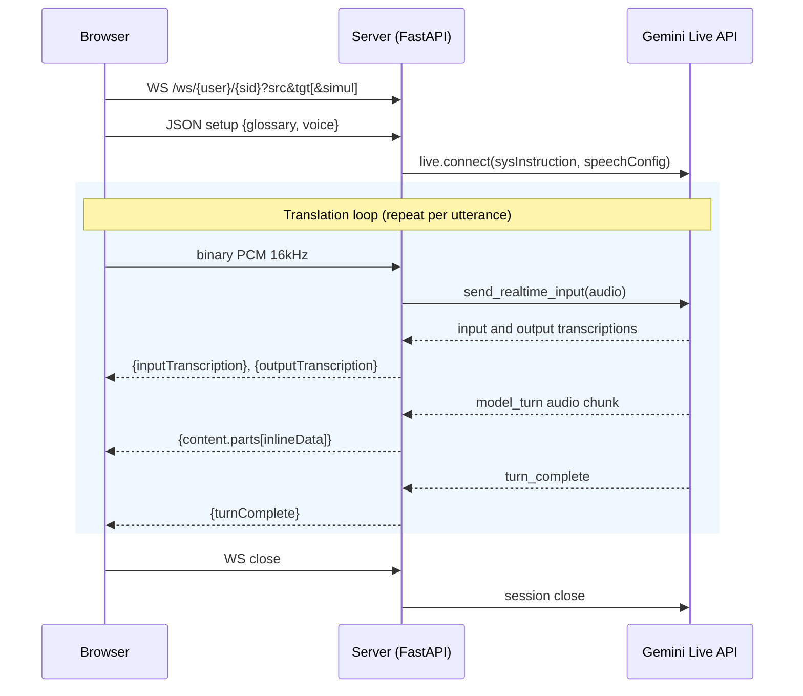
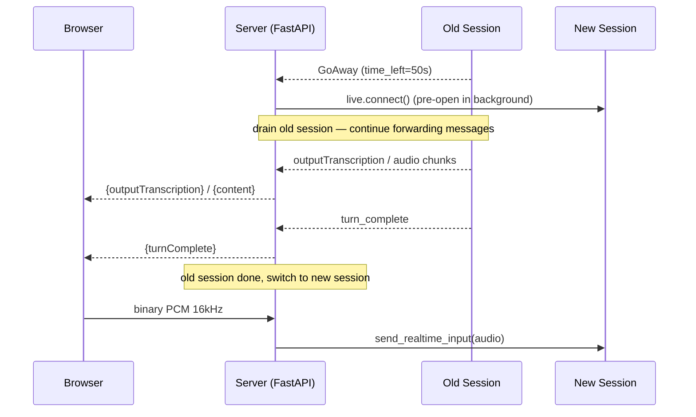
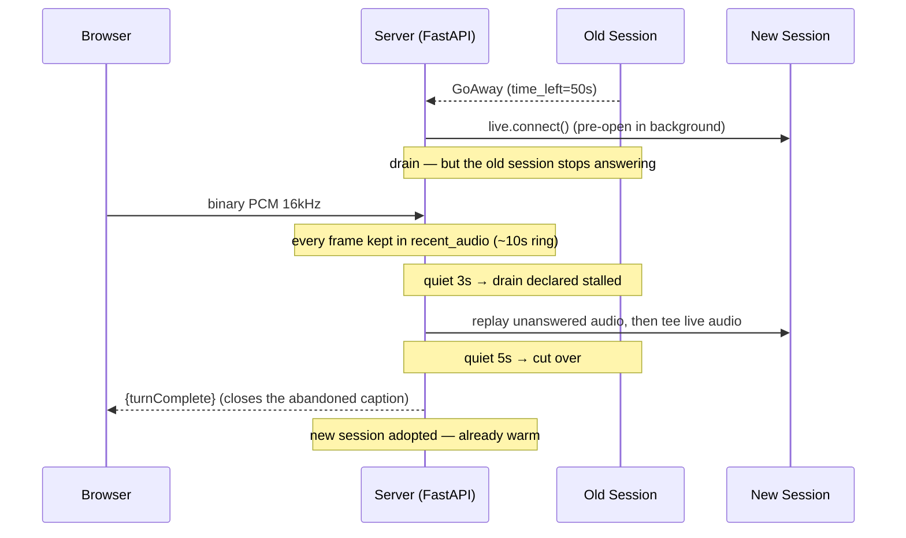

# Live Translator

Real-time audio translation powered by Gemini Live API. Speak in any language and hear the translation immediately. The default is **conversation mode**: a bidirectional interpreter between the two selected languages (97 languages, glossary), so two people can talk to each other. Toggling **Simul** switches to simultaneous translation mode (78 languages, auto-detect source language, one-way into the target).


A browser tab's audio — a video, a webinar, the remote side of a call — is something a web page cannot reach, so that case grew a Chrome extension of its own: **[Interpretab](https://github.com/kazunori279/interpretab)**, now a separate repo that talks to the Gemini Live API directly ([why](#chrome-extension--interpretab)).

## Slides

[**Real-time voice on the Gemini Live API**](https://kazunori279.github.io/live-translator/slides/) — a ~15 minute deck that uses this app as the worked example: what it does, the Gemini Live API underneath it, and what an hour of soak testing on Cloud Run taught us. Press `n` for speaker notes, `f` for fullscreen, `⌘P` to export a PDF.

## Getting Started

### Prerequisites

- Python 3.10+
- [uv](https://docs.astral.sh/uv/) package manager
- [Gemini API key](https://aistudio.google.com/apikey)

### Setup

```bash
uv sync
```

Create `app/.env` with your API key:

```
GOOGLE_API_KEY=your-api-key
```

### Run

```bash
uv run uvicorn app.main:app --reload
```

Open http://localhost:8000.

## User Guide

### Basic Usage

1. Pick your two languages at the bottom of the screen. Your choice is remembered by this browser, so the pair you use every day is already set the next time you open the app.
2. Click **Start**, and allow microphone access when the browser asks.
3. Talk. What you said appears as text, and the translation is spoken aloud.

Two buttons sit side by side, one for each direction of audio. A struck-through icon and a grey background mean that side is silenced.

- **Mic on / Mic off** is what **Start** becomes once you are running. Muting stops sending your voice but keeps the microphone ready, so unmuting is instant and the browser won't ask for permission again.
- **Sound on / Sound off** silences the spoken translation coming out of this machine. Translation carries on regardless — the transcript and the [caption overlay](#caption-overlay) keep filling in, so muting the sound is not the same as stopping. It works before **Start** as well as during a session, which is what you want when the audio is meant to reach a PA or another device rather than your own speakers: pre-mute and the first sentence never comes out loud.

### Conversation (default)

Two people, two languages, one session. Say something in either of the languages you picked and the app speaks it in the other one. With English and Japanese selected, English comes out as Japanese and Japanese comes out as English — you never tell it who is talking, it works that out from what it hears.

Good for a two-way meeting, an interview, or a conversation at a booth.

- Both language dropdowns stay visible — choose the pair you want to interpret between.
- Your glossary applies in both directions.
- One voice speaks both sides of the conversation.
- If someone speaks a *third* language, it comes out in the second of your two languages — the one on the right. A bystander at a booth speaking French, in an English/Japanese session, is translated into Japanese rather than English ([why](#speech-in-a-third-language)).

### Simultaneous Translation

Switch on **Simul** for one-way translation: whatever the microphone hears, in whatever language, comes out in the single language you choose. There is no source language to set, so that dropdown disappears.

Good for a talk, a lecture, or a presentation — one speaker, an audience that needs one language.

Compared with conversation mode:
- **Speech already in the target language is left alone.** Say something in Japanese with Japanese selected and you get the transcription and nothing else — no translated text, no voice. That is deliberate, and it is this mode's only echo guard: its own output is by construction in the target language, so without it a microphone hearing the speakers would loop. The control bar says so under **Translate to:**. It also means testing the mode with a phrase in the target language looks exactly like a broken session.
- **Nothing to configure but the output language** — it works out what is being spoken.
- **78 languages** to choose from, rather than 97.
- **The glossary doesn't steer the translation**, though your on-screen term substitutions still apply.
- **Captions settle a moment later.** This mode doesn't signal where a sentence ends, so text is finalized after about two seconds of quiet.

Switching **Simul** back off returns you to conversation mode, and your language choices carry over.

### Push to Talk

Reach for this when the app is hearing more than you want it to — a noisy room or a busy booth, other conversations nearby, or [echo and feedback](#echo-and-feedback) from your speakers. The microphone only listens while you hold the button down, so background noise and the app's own voice never reach it between your turns.

Toggle **Push to Talk** on the right to switch from always-on to manual control. Hold the **Hold to Talk** button (or press spacebar) to transmit, release to stop.

### Voice & Audio Settings

Click **Voice & Audio** in the header to choose your microphone, your speaker, and the **voice** that reads the translation — 30 to pick from, each labelled with its character (`Kore — Firm`, `Sulafat — Warm`). All three are remembered by your browser.

Microphone and speaker changes take effect straight away. Changing the voice restarts the session, which clears the transcript.

The app remembers every microphone and speaker you have chosen, in order of preference, and always uses the best one currently plugged in. Unplug your headset mid-session and it drops to your next favourite rather than to whatever the system picks. Plug it back in and it takes over again. Choosing **System Default** clears the list — that is read as "stop managing this for me".

### Glossary

Click **Glossary** in the header to pin specific terms to fixed translations — product names, jargon, anything the model tends to get creative with. Your glossary is saved in your browser and applies only to you.

Upload a UTF-8 CSV with `source,target[,transcription]` per line:

```csv
Kubernetes,クバネティス,Kubernetes
Cloud Run,クラウドラン,Cloud Run
Vertex AI,バーテックスエーアイ,Vertex AI
```

The third column is optional and only changes what you see: the app *says* the second form and *shows* the third. That is useful for product names where you want a phonetic pronunciation but a normal spelling on screen.

Changes take effect next time the session starts — click **Start** again, or change a language.

### Caption Overlay

Put translated subtitles on top of any window — useful for presenting at an event, or for screen sharing on Google Meet. Click **Caption** in the header, or go to `/caption`.


1. Open the main app in Chrome and click **Start** to begin translating
2. Click **Caption** in the header — a new window opens with a "Select Window" button
3. Click **Select Window** and pick the window to mirror (your slides, Keynote, any app)
4. That window's content appears in the caption page, with translated subtitles along the bottom
5. Click **⛶ Fullscreen** in the top-right (or press **F**, or double-click) to fill the screen
6. Share this caption window on Google Meet — participants see your slides with live subtitles

Fullscreen is a separate click from *Select Window* on purpose; the two can't be combined for browser security reasons. The button appears once mirroring starts and fades after 4 seconds so it stays off your slides — move the mouse to bring it back. **Esc** exits, as does stopping the screen share.

Both windows have to be in the same browser, and it must be Chrome. No OBS or other tools are needed.

### Connection States

The dot in the top-right corner shows:
- **Yellow / Connecting…** — establishing the connection
- **Green / Connected** — ready to translate
- **Red / Disconnected** — connection lost; it retries automatically after 5 seconds

### Echo and Feedback

**If you are on a phone, tablet, or laptop using its own built-in microphone and speakers, you can skip this section.** Your device cancels its own echo, and the app leaves that switched on. The same goes for headphones or an ordinary headset.

You may run into echo if you are doing any of the following:

- Sending sound to a speaker other than **System Default** in Voice & Audio
- Using external speakers, a PA system, or a mixing desk
- Playing the translation on one device and picking it up with another
- Working in a large or echoey room, or with a distant speaker

In those setups the translation comes out of the speakers, the microphone hears it, and the app treats its own voice as something new to translate — so it starts talking to itself. It won't build into a squeal the way a PA system does. It keeps going at normal volume, one full sentence at a time, which is harder to notice and harder to stop.

The app pushes back on this in several ways ([how](#echo-handling)), but they only go so far. If you hear an echo, try these in order:

1. **Put on headphones.** This breaks the loop at the source and always works.
2. **Set the speaker back to System Default** in Voice & Audio. Sending audio anywhere else switches off the browser's echo cancellation — this is the most common cause of bad echo.
3. **Turn the volume down**, or move the microphone further from the speakers.
4. **Mic off** while the translation is playing, so the microphone isn't open to hear it.
5. **Sound off**, if this machine doesn't need to play the translation at all — with nothing coming out of the speakers there is no loop to close, and the transcript and captions carry on as normal.

Playing the translation through a PA system, a mixing desk, or a second computer defeats echo cancellation completely, because the sound never goes through this browser. In those setups headphones or a close-up microphone aren't optional.

---

## Chrome Extension → Interpretab

The web app can only translate what a microphone hears. That covers a booth or a meeting room, but not the case people keep asking for: a video, a webinar, or the remote side of a Google Meet call **already playing in a browser tab**. A web page cannot reach another tab's audio. A Chrome extension can, and that extension used to live in `extension/` here.

It has moved to its own repository: **[kazunori279/interpretab](https://github.com/kazunori279/interpretab)**.

The reason for the split is architectural rather than cosmetic. The extension in this repo was a *second client of this relay* — the same `/ws/{user_id}/{session_id}` endpoint, the same server holding `GOOGLE_API_KEY`. That is fine for the author's own laptop and impossible to publish: every installer's audio would go through one `--max-instances 1` Cloud Run service that the author pays for. Interpretab drops the relay entirely, opens the Gemini Live API directly from the browser with the user's own key, and carries the session management that used to live in `app/main.py` into JavaScript. There is no server in it at all, which is what makes a public Chrome Web Store listing honest.

What that repo has that this one never did: bring-your-own-key setup, the wire-level `setup` frame instead of the SDK's flattened config, and a JavaScript port of the GoAway cutover with its own unit tests. What it deliberately left behind: the stalled-drain mirroring in [GoAway Handling](#goaway-handling) below, which makes a cutover lossless rather than merely short.

The MV3 findings from building it are still worth reading, and stay here: [Chrome Extension Internals](#chrome-extension-internals).

---

## Technical Details

### Sequence Diagram



FastAPI bridges one browser WebSocket to a series of Gemini Live API sessions. The browser WS lives for the lifetime of the user's tab; upstream Live sessions are opened, expire (~15 min), and reopened underneath it transparently.

**Connection lifecycle:**

1. Browser opens WebSocket to `/ws/{user_id}/{session_id}` and sends a JSON setup frame with the per-browser glossary
2. Server builds a system instruction embedding the glossary and language pair
3. Two background coroutines run concurrently:
   - **session_loop** opens a Gemini Live session, drains messages from it, and forwards them as JSON envelopes to the browser
   - **upstream_task** forwards binary audio frames from the browser WS to whichever upstream session is current
4. When the upstream session sends a GoAway (observed `time_left=50s`), the server immediately starts opening the next session in the background while continuing to drain the current one — this eliminates dead time between sessions
5. Once the old session finishes, the pre-opened session takes over seamlessly

**Wire format:** Each `LiveServerMessage` is translated into a camelCase JSON envelope the frontend understands (`turnComplete`, `inputTranscription`, `outputTranscription`, `content.parts[]`, `usageMetadata`).

**Transcription behavior:** Output transcription (the translated speech) streams in multiple partial chunks, so the UI can show word-by-word updates with a typing indicator. Input transcription (the user's spoken words) arrives as a single message with the complete text — the API does not stream partial input transcriptions, so the user's bubble appears all at once.

### Models

**Agent mode** uses `gemini-3.1-flash-live-preview` via the Gemini API (`generativelanguage.googleapis.com`). The system instruction (built in `app/translator_agent/agent.py`) tells the model to translate only the current utterance and never repeat previous translations. The glossary is embedded as `source → target` pairs with case-insensitive matching.

**Simultaneous translation mode** uses `gemini-3.5-live-translate-preview` with a `TranslationConfig` instead of system instructions. The config specifies `target_language_code` and `echo_target_language=False` (see [Echo Handling](#echo-handling)). This model auto-detects the source language and does not support tools, glossary, or system instructions.

**Conversation mode** (the UI default) reuses the agent model (`gemini-3.1-flash-live-preview`) but with a bidirectional interpreter system instruction (`build_conversation_instruction` in `app/translator_agent/agent.py`): it tells the model to detect which of the two configured languages each utterance is in and reply in the other. The WebSocket carries a `convo=true` query param; the glossary is embedded bidirectionally (`source ↔ target`). Without that param the server falls back to one-way agent mode (`build_system_instruction`), which the UI no longer requests but the test harness still exercises.

Audio input is 16 kHz mono PCM; output is 24 kHz PCM (both modes).

### Speech in a Third Language

A booth or a lecture hall carries speech the session was never set up for — a bystander, a nearby conversation, a video playing. Left to itself the interpreter translated that speech into **English** in an en/ja session: not the target, but the *other* configured language, and the one language in that room nobody needed it in.

Silence is the behaviour you actually want, and the model will not do it. Asked to produce nothing it either translated the utterance anyway or parroted it back verbatim in the language it was spoken in. Four successive phrasings, up to and including an explicit "produce no output at all: no speech, no sound, no text", gave **zero silences in ten attempts** — the same limit the simul mode notes below run into, where prompt-level suppression was unavailable and only `echo_target_language=False` worked. A parroted utterance is also invisible in the transcript: it arrives as audio with no output transcription at all, so it looks like silence in the logs and is only identifiable from the audio itself.

So `_off_language_route` in `app/translator_agent/agent.py` routes the case instead of forbidding it. The model is going to speak; the language it speaks in is the part that is controllable.

Naming the destination was not enough on its own — "translate it into Japanese, and not into English" still went to English 2 of 3 times. What fixed it was collapsing the three routes into the binary test they actually are:

> if the utterance was in `b`, reply in `a`; in every other case, reply in `b`.

Both `a → b` and `other → b` share a destination, so the model never has to classify three ways — it only has to answer "was that `b`?", and `a` is described as reserved for the single job of rendering what a `b` speaker said. With that phrasing, French, German, and Spanish all routed to Japanese, 8 for 8, and both original directions still pass.

The tradeoff is that a third language is still translated and still spoken; it is merely spoken into the language the audience is listening in. Genuinely suppressing it needs a server-side gate on the input transcription rather than a prompt.

### Echo Handling

Translated speech is played out loud, so any setup where the speakers reach the microphone closes a loop. It is worse than ordinary PA howl in one respect: each round trip is a fresh, fully-formed sentence rather than a resonant frequency, so it needs no gain margin to sustain and can run indefinitely at conversational volume. Three defences act in sequence.

**1. Browser echo cancellation (AEC).** `app/static/js/audio-recorder.js` requests `echoCancellation: true` and `noiseSuppression: true` explicitly rather than relying on the spec default, which is `true` in every browser targeted today but is not ours to depend on. AEC runs inside the browser's input-processing stage, before `createMediaStreamSource` and before the app sees a sample: it knows what was sent to the output device and subtracts that from the microphone signal. `autoGainControl` is deliberately **off** — it flattens the speaker's dynamics, and the system instruction asks the model to preserve tone and urgency.

**2. Simul mode — `echo_target_language=False`.** The translation model accepts no system instruction, so a prompt-level guard is unavailable there; this config flag is the only echo control it has. It tells the model to stay silent on input already in the target language. That matters because the model's own output is, by construction, in the target language — with `True` the model parroted its own echo straight back out, giving a loop with gain ≈ 1 and no natural decay. The tradeoff is that a human genuinely speaking the target language gets no audio out, which is the desired behaviour for one-way translation anyway. Google's own docs also note that `True` introduces artifacts from background noise and music.

**3. Conversation and agent modes — `_ECHO_GUARD`.** Both system-instruction builders in `app/translator_agent/agent.py` end with a paragraph asking the model to stay silent when an utterance is its own earlier output coming back. This is a hint, not a rule: the model has no ground truth for what it emitted, its false-positive mode silently drops a real utterance, and it cannot reliably break a loop already in progress.

**Where AEC stops working.** These are the setups that echo badly:

- **Output routed to a non-default device.** Picking a speaker other than the system default calls `setSinkId`, but the canceller's reference signal is tied to the default output. It ends up subtracting audio nobody is playing, so cancellation is effectively off. This is the most common cause of heavy echo here.
- **A PA system, external mixer, or second machine playing the audio.** The sound never passes through this browser's output path, so there is no reference signal to subtract. Nothing in the stack can help.
- **Acoustic delay beyond the filter tail.** AEC models a finite tail, typically ~100–250 ms. A large room, a distant speaker, or a Bluetooth output whose latency exceeds that puts the echo outside the window the canceller can match.
- **Double-talk.** When someone speaks over the playback, cancellers throttle back to avoid chewing up the near-end voice, and more echo leaks through.

### Audio Devices and Voices

Microphone and speaker choices build a **priority list** rather than a single setting, stored in `localStorage` under `live-translator.audio.inputPriority` / `outputPriority`. Each device picked moves to the top of its list (up to 10 remembered), and the app uses the highest-ranked device actually attached. On `devicechange` the list is re-evaluated and the running pipeline switches mid-session, so losing the mic in use drops to the next favourite instead of the system default. Picking a device also restarts the recorder or player immediately — persisting alone left the pipeline reading the old device until a reload. Choosing **System Default** is a deliberate opt-out and clears the list.

Each entry stores **both `deviceId` and label**. A `deviceId` is perishable — the browser re-salts it when site permissions are cleared, and some devices return with a new one after a replug — so if the saved id no longer resolves, the device is matched by name and the stored id is repaired in place, keeping its rank. Entries for absent devices are retained, so plugging one back in reclaims its position.

The voice is part of the Live session's config, so changing it requires a reconnect (which clears the transcript); microphone and speaker changes do not. Unknown voice names sent by a client are rejected server-side and fall back to `Puck`, since the Live API refuses to connect on an unrecognised voice.

Language selections survive a mode switch: codes are mapped between the two language sets in both directions (e.g. `zh` ↔ `zh-Hans`, `iw` ↔ `he`, `pt` ↔ `pt-BR`).

They also survive a reload, stored under `live-translator.sourceLang` / `targetLang`. Two details make that work:

- **The target is stored in the code set of the mode that was on screen**, and restored straight into that mode rather than mapped in and back out. A round trip through the agent table would flatten the simul-only variants — `zh-Hant` and `pt-PT` have no agent equivalent, so they would come back as `zh-Hans` and `pt-BR`.
- **The stored pair is written into the hidden inputs at module load, before the first `connectWebsocket()`.** That call is synchronous while `loadLanguages()` is still fetching, so it takes whatever the inputs hold; left on the markup defaults, the session would open on `en`/`ja` while the dropdowns showed something else. Once the fetch resolves, the pair the socket was opened with is compared against the dropdowns and the session is reopened if a stored code turned out to be one the server no longer offers and the dropdown fell back.

### Caption Overlay Internals

The caption page uses the [Screen Capture API](https://developer.mozilla.org/en-US/docs/Web/API/Screen_Capture_API) to mirror the target window and the [BroadcastChannel API](https://developer.mozilla.org/en-US/docs/Web/API/BroadcastChannel) to receive transcription from the main page, so both pages must run in the same browser. No OBS or third-party tools needed.

Fullscreen needs its own click, separate from *Select Window*: `requestFullscreen()` consumes the transient user activation that `getDisplayMedia()` also requires, and the window picker preempts an in-flight fullscreen transition. Hence the dedicated button, which appears once mirroring starts and fades out after 4 seconds.

### Chrome Extension Internals

The code now lives in [Interpretab](https://github.com/kazunori279/interpretab), but the MV3 findings came out of building it here and are the part worth keeping. The server needed no changes at all for it: `/ws/{user_id}/{session_id}`, its `source`/`target`/`simul`/`convo` query params and its setup frame were already everything a second client needs. Everything below is client-side, and all of it survived the move.

```
service-worker.js     switchboard only. Action click → tabCapture.getMediaStreamId(),
                      create the offscreen document, open the side panel, inject
                      the caption script. Holds no audio and no socket.
offscreen.js          the engine. Owns every MediaStream, AudioContext and WebSocket.
sidepanel.js          controls and the transcript. Closing it does not stop capture.
content/captions.js   subtitles in a closed shadow root, injected on demand.
options.js            backend URL (now an API key), voice, glossary CSV.
```

**Why an offscreen document.** An MV3 service worker is torn down after ~30 seconds idle, and a side panel dies when it is closed — neither can hold a live capture. An offscreen document created with `USER_MEDIA` + `AUDIO_PLAYBACK` has a lifetime independent of both, so putting the engine there removes the need for any keepalive hack. The service worker keeps what little state it has in `chrome.storage.session`, never in a module variable.

**Three AudioContexts, shared by sample rate rather than by direction.** Chrome caps contexts per document at around six and the per-direction layout needs five:

```
tabStream ─┬─► ctxPass (native rate) ─► duckGain ─► speakers
           └─► ctxUp (16 kHz) ─► pcm-recorder-processor ─► tab socket
micStream ───► ctxUp (16 kHz) ─► pcm-recorder-processor ─► mic socket
both sockets' audio ─► ctxDown (24 kHz) ─► pcm-player-processor ─► speakers
```

`ctxPass` runs at the stream's native rate on purpose: pushing 48 kHz tab audio through the 24 kHz player context would resample it down and audibly dull anything musical.

**Ducking and the duplex gate share one signal.** Model audio arrives far faster than realtime, so "is a voice speaking right now" cannot be answered by "did a frame just arrive". Each arriving buffer extends a play-out deadline by `byteLength / 2 / 24000` seconds; ducking and the microphone gate both read that deadline (plus a 400 ms release), and `duckGain` moves on a `setTargetAtTime` ramp so it does not click.

**Transcripts are segmented by a silence gap, not by a turn.** Simultaneous translation never sends `turnComplete` — there are no turns in a continuous feed — so the accumulator that joins streamed increments has no natural end and would run for the whole session, leaving one caption line that grows until it covers the video. A 2 s gap in the increments closes the sentence instead, the same rule and the same interval `app/static/js/app.js` uses. Independently, a caption line is capped at three wrapped rows and bottom-aligned inside the clip, so a long sentence loses its already-read head rather than its newest words.

**Two directions are two independent sessions, all the way down.** Each opens its own browser WebSocket to `/ws/chrome-extension/{tab|mic}-{random}`, which the server backs with its own Gemini Live session — different models, different query params, no shared state, and the API cost of both. They also share exactly one page overlay, so the caption path carries a `direction` and everything downstream is keyed by it: the offscreen document filters the fan-out against that direction's *Subtitles on the page* switch, and the content script keeps one open line per direction rather than a single current line. Without that key, whichever direction spoke last would overwrite the other's sentence mid-word. A microphone-only run has no captured tab, so the overlay goes on the tab the toolbar icon was clicked on — `activeTab` covers that one either way.

**Permissions are kept small.** No content script is declared and there is no `<all_urls>`: subtitles are injected with `chrome.scripting.executeScript` under `activeTab`, which the toolbar click already grants. Here the backend origin had to be an `optional_host_permission` requested on the Start click, because the relay URL is configurable and cannot be baked into a manifest; the direct version has a single fixed host permission instead, which is both simpler and a better answer to a store reviewer.

**Bundled worklets.** MV3 forbids remote code, so the extension carries its own copies of `app/static/js/pcm-recorder-processor.js` and `pcm-player-processor.js` rather than fetching them from the server. They are 16 and 50 lines; copying beat adding a build step. While both lived in this repo an asset test asserted the copies were byte-identical, because a stale copy keeps working while sounding wrong — worth knowing if you ever vendor a worklet.

### Changing the Default Glossary

Edit `app/dict.csv` and redeploy. The glossary is per-browser (`localStorage`) and sent to the server on each new session, so browsers with a cached glossary keep using it until the user clicks **Reset to defaults** in the modal.

### GoAway Handling

Gemini Live sessions do not last indefinitely. In 30-minute soaks a GoAway arrived every ~9 minutes, always with `time_left=50s`. When the server receives one:



1. A new session starts opening immediately in the background (`_open_next()`), ready in ~200ms
2. The old session continues draining — any in-progress translation completes and is forwarded to the browser
3. After the old session ends, the pre-opened session becomes the active session
4. Audio from the browser is routed to the new session with no gap

A drain that never finishes its turn is the awkward case: waiting out the whole 50s deadline is dead air the listener hears in full. Two thresholds bound it, both measured from the last frame actually forwarded to the browser (heartbeats don't count, so a turn genuinely in flight is never clipped):



5. At `DRAIN_MIRROR_QUIET_SEC` (3s of quiet) the drain is treated as stalled and the microphone is teed into the replacement as well — speech going into a session that has stopped answering still reaches one that hasn't
6. At `GOAWAY_IDLE_GRACE_SEC` (5s of quiet) the swap happens, instead of waiting out the deadline. The abandoned turn will never report itself complete, so the server sends a synthetic `turnComplete` to close the caption the client left open
7. If a mirrored drain recovers and completes its turn after all, the replacement is discarded and a fresh one opened — it heard audio the old session went on to answer, so keeping it would mean translating the same words twice

What gets replayed into a replacement is decided by one rule: **the audio captured since the outgoing session last said anything.** Nothing was relayed after that point, so none of it has been translated, and anything older has been — replaying that too would translate the same words twice. `recent_audio` keeps every mic frame with its arrival time for ~10s so the cut can be made at that boundary rather than at a fixed offset.

This also covers the case the thresholds alone miss: a GoAway that lands mid-sentence on a session that had already been quiet for longer than the grace. The cutover then happens within milliseconds and the mirror never attaches, but the sentence so far is still owed to the replacement, and is handed to it the moment it is adopted.

**What it costs the listener.** Across 11 GoAways observed in soak testing (two 30-minute local runs and one 1-hour Cloud Run run), a GoAway takes one of four paths:

| Path | Observed | Effect |
|---|---|---|
| Old session finishes its turn | — | none — the swap happens between turns, mic audio keeps flowing to the dying session throughout |
| Drain stalls, then recovers and completes its turn | 5 | none to the listener. The mirrored replacement heard audio the old session went on to answer, so it is discarded and a fresh one opened (~190ms, off the critical path) |
| Drain stalls and never recovers | 3 | up to 5s before the translation lands, and only in a window where nothing was being delivered anyway. All three landed between utterances with no audio owed. The mirror means the replacement has been working on that audio for the last 2s, so it flushes shortly after the swap rather than starting cold |
| GoAway lands mid-sentence on an already-quiet session | 3 | cutover in 2–4ms, the sentence so far (1.4–3.5s of audio) replayed 83–197ms later. All three iterations scored 10/10 at normal latency. Before the replay was added, all but the last word of that sentence was lost |

The soak speaks one sentence every ~17s with quiet gaps in between, which biases heavily towards the stalled paths — continuous speech keeps the drain talking and takes the first row far more often than these counts suggest.

The speaker never has to pause or repeat — every frame is captured regardless of which session is live. On the two cutover paths the seam is visible rather than audible: the synthetic `turnComplete` closes the caption the abandoned turn left open, and the replacement's translation of the same audio appears as a new caption below it.

**Watch out for turn accounting.** The synthetic `turnComplete` is a turn boundary with no turn behind it. Anything pairing utterances 1:1 with turn boundaries over a long-lived socket will sit one turn behind for the rest of the connection once a cutover happens — the soak test did exactly this and reported 68% while translation itself was perfect. `tests/test_long.py` now flushes frames belonging to a turn it gave up on and rejects a boundary with no content in front of it; the browser client is unaffected because `finalizeTurn()` on an already-closed caption is a no-op.

**Limitations:**

- The model on the new session has no context from the previous one, so it starts fresh. The replay covers the audio, not the history.
- On the cutover paths, mic audio arriving between the cutover and the adoption of the replacement (83–197ms observed) is still dropped: `pending_preroll` is captured as bytes at cutover, so frames landing during the wait are not in it. Capturing the cut timestamp instead and building the replay at adoption would close this.

Session resumption was intentionally removed — it caused an off-by-one translation cascade where the model would prepend the previous turn's translation to the current one. Without resumption, each session starts clean, which proved more reliable (98% pass rate vs 65% with resumption in 1-hour soak tests).

### Gemini Live API Transient Errors and Recovery

The Gemini Live API occasionally returns `1011 (service currently unavailable)` errors. A later Cloud Run soak also recorded `1008 (policy violation) The operation was aborted.` 31 times in an hour; the recovery path below does not branch on the close code, so it handles both, and 30 of those 31 never reached a client.

Before the recovery fix, production logs showed ~20 errors per 24 hours in two patterns:

- **Mid-session kill** (~65% of cases): An active session is disconnected during `session.receive()`. The session was working, then Gemini drops it.
- **Connect-time rejection** (~35% of cases): Gemini refuses to open a new session entirely. This typically follows a mid-session kill — the retry fails because Gemini is still recovering.

These errors cascaded: a mid-session kill triggered a retry with a flat 1s delay, which was often also rejected because Gemini was still unavailable. The session connect call had no timeout, so it could hang indefinitely on unresponsive connections.

**Recovery logic in `session_loop`:**

1. **Connect timeout** (`CONNECT_TIMEOUT_SEC = 10`): The `conn.__aenter__()` call has a hard timeout so a hanging connect fails fast instead of blocking indefinitely.
2. **Exponential backoff**: Retries start at 0.2s and double on each consecutive failure, capping at 4s. The backoff resets after a successful session. This avoids thrashing the API while still recovering quickly from transient blips.
3. **Transparent reconnect**: The browser WebSocket stays open during retries — only the upstream Gemini session is affected. Once a new session opens, `upstream_task` resumes forwarding audio to it automatically.
4. **No deadlock on the retry path**: `next_ready` is set only by the GoAway pre-open. Waiting on it when no open is in flight — after a session error, say — parked the loop forever, so the wait is gated on an `open_pending` flag and the error path clears it. This showed up in production as the app going unresponsive until the browser reconnected.

After the fix, production logs showed 1 error in 15 hours (vs ~12 in the same period before), with zero connect-time rejections — the faster initial retry reconnects before the cascading failure pattern kicks in.

For real users streaming from a microphone, recovery is seamless — the new session picks up the live audio stream with a brief gap. For health checks that send a one-shot audio clip, the clip may be lost if the session dies before producing a response.

### SDK Note

`app/main.py` clears `GOOGLE_GENAI_USE_VERTEXAI`, `GOOGLE_CLOUD_PROJECT`, and `GOOGLE_CLOUD_LOCATION` before constructing the genai client. These env vars cause the SDK to route through `aiplatform.googleapis.com`; clearing them forces Gemini API key routing via `generativelanguage.googleapis.com`.

### Deployment to Cloud Run

```bash
set -a && source app/.env && set +a

gcloud run deploy live-translation \
  --source . \
  --project YOUR_PROJECT \
  --region us-central1 \
  --allow-unauthenticated \
  --timeout 3600 \
  --min-instances 1 \
  --max-instances 1 \
  --set-env-vars "GOOGLE_API_KEY=${GOOGLE_API_KEY},LOG_LEVEL=INFO"
```

Key flags:
- `LOG_LEVEL=INFO` — the app defaults to `DEBUG`, which is useful locally but makes the `websockets` client log the whole Live API handshake, `x-goog-api-key` header included. On Cloud Run that goes to Cloud Logging, so deployments turn it down.
- `--timeout 3600` — allows hour-long WebSocket conversations (upstream Live sessions cycle internally every ~15 min)
- `--min-instances 1` — avoids cold start latency
- `--max-instances 1` — session resumption handles are stored in-memory; multi-replica requires a shared store (e.g. Redis)

#### Deploying to more than one region

Cloud Run services are regional, so the same command with a different `--region` gives a second independent endpoint under the same service name. This deployment runs in `us-central1` and `asia-northeast1` (Tokyo):

```bash
gcloud run deploy live-translation --source . \
  --project YOUR_PROJECT --region asia-northeast1 \
  --allow-unauthenticated --timeout 3600 \
  --min-instances 1 --max-instances 1 \
  --set-env-vars "GOOGLE_API_KEY=${GOOGLE_API_KEY},LOG_LEVEL=INFO"
```

What this does and does not buy you. The relay moves closer to the listener, which cuts the browser↔server leg of every audio frame — worth having for an audience in Japan. It does not move the model: `app/main.py` routes through `generativelanguage.googleapis.com` with an API key, so the server↔Gemini leg is unaffected by where the container runs. Each region also keeps its own in-memory session state, so a client must stay on one endpoint for the length of a conversation; there is no shared store to fail over to. Pick the region per event rather than load-balancing across both.

## Testing

### E2E Test

`tests/test_e2e.py` checks that each mode does its own distinctive job, rather than just that something came back. It speaks into a session with macOS `say`, streams the audio over the WebSocket, and judges the reply.

The cases that matter:

- **Conversation** interprets in *both* directions — one case speaks English and expects Japanese, one speaks Japanese and expects English, and one does both inside a single session. A fourth speaks French into an English/Japanese session and expects Japanese, pinning the routing described in [Speech in a Third Language](#speech-in-a-third-language) — left alone the model sent it to English.
- **Simultaneous** translates one way into the target, and stays silent when the input is already in the target language. That silence case guards [`echo_target_language=False`](#echo-handling).
- **Agent** translates one way, source to target. Not reachable from the UI, still served.
- **Coverage** runs the remaining language pairs through the default mode.

Direction is verified by writing system (kana, hangul, Latin, CJK-without-kana), so a mode that translated the wrong way would fail rather than pass on "some text arrived".

Audio is judged by level and duration, not by frame count. A model declining to speak still streams frames — they are just digital silence, and the stream occasionally carries a lone blip above the noise floor. So "did it speak" means at least three frames above RMS 50 on a 32768 scale; measured utterances ran 8–16 such frames, and quiet streams 0–1.

```bash
# every case, against a local server
uv run python tests/test_e2e.py

# one mode, or one case
uv run python tests/test_e2e.py --mode simul
uv run python tests/test_e2e.py --match "both ways"

# one ad-hoc utterance
uv run python tests/test_e2e.py --say en ja "Hello, how are you?"
```

Options: `--url` (WebSocket base URL, default `ws://localhost:8000`), `--mode` (`convo`, `simul`, or `agent`), `--match` (substring of a case description), `--say SOURCE TARGET TEXT`.

Requires macOS (`say`) and `ffmpeg`.

#### Latest E2E results (local server)

```
Test                                         Mode    Status Why
------------------------------------------------------------------------------
Conversation: forward (en spoken)            convo   PASS   got ja output
Conversation: reverse (ja spoken)            convo   PASS   got en output
Conversation: both ways in one session       convo   PASS   got ja+en output
Simul: translates into the target            simul   PASS   got ja output
Simul: silent on target-language input       simul   PASS   stayed silent, as expected
Agent: one-way source to target              agent   PASS   got ja output
Coverage: English to Spanish                 convo   PASS   got es output
Coverage: English to French                  convo   PASS   got fr output
Coverage: English to Korean                  convo   PASS   got ko output
Coverage: English to Chinese                 convo   PASS   got zh output

10/10 tests passed
```

The two-way case is the one worth reading the transcript for: "Good morning. How was your trip?" came back as 「おはようございます。旅はどうでしたか?」, and the Japanese reply 「とても楽しかったです。ありがとうございます。」 came back as "It was wonderful, thank you!" — both directions inside one session.

### Glossary Test

`tests/test_glossary.py` replays recorded and synthetic transcription fragment sequences through `_TranscriptRewriter` and asserts the text the browser ends up with. It is offline — no server, no API key, no audio — so it runs in under a second.

The cases cover a term split three ways with no `finished` message (captured from a live run), a term split one character at a time, two terms split in one sentence, a `finished` message superseding the accumulated partials, and a held tail that never becomes a term and so must be released rather than swallowed. The last case is run twice, once with `turnComplete` and once without, because simul never sends one.

```bash
uv run python tests/test_glossary.py
```

```
8/8 passed
```

### Soak Test

`tests/test_long.py` validates translation quality, latency, glossary behavior, and session stability over extended periods (default 1 hour).

It generates random English sentences via Gemini Flash Lite, converts them to audio with Google Cloud TTS, streams them through the translator WebSocket, transcribes the returned audio with Google Cloud STT, and verifies semantic correctness.

```bash
uv sync --extra test

# 2-minute smoke test against local server
uv run python tests/test_long.py --duration 120

# 1-hour test against Cloud Run
uv run python tests/test_long.py --url wss://YOUR_CLOUD_RUN_URL --duration 3600
```

Options: `--url` (WebSocket base URL), `--duration` (seconds), `--source`/`--target` (language pair), `--mode` (`convo`, the app default; `simul`; or `agent` for the one-way path), `--log` (JSONL output path).

Each run writes a `.report` alongside its JSONL. `tests/chart_soak.py` draws those distributions as bar charts, one run or several side by side, which is how the comparison charts below were produced:

```bash
uv run python tests/chart_soak.py soak_convo.report
uv run python tests/chart_soak.py convo.report simul.report --labels convo simul \
  --metrics "Translation Score" "Turn Complete"
```

Testing against `wss://` from macOS may fail with `CERTIFICATE_VERIFY_FAILED` if the Python framework build has no CA bundle. Point it at certifi's: `export SSL_CERT_FILE=$(uv run python -c "import certifi;print(certifi.where())")`.

All three modes are driven with source-language audio and scored against a target-language translation. Simul is measured slightly differently: it never sends `turnComplete`, so an iteration is considered finished once transcription has been quiet for two seconds — the same rule the browser UI uses to close a caption bubble. The latency figure is back-dated to the last transcription so it stays comparable across modes. Idle is judged on transcription rather than on frames because simul keeps streaming silent audio after it stops speaking.

#### Simul smoke results (90s, en → ja, local server)

Short run recorded when simul support was added, alongside a convo-mode control on the same server.

```
simul  Duration: 102s | Iterations: 6 | Passed: 6/6 (100.0%) | Avg score: 10.0/10 | Errors: 0
       Turn Complete (speech-end to full translation), n=6
       min=0.17  avg=0.84  p50=0.87  p90=1.44  max=1.44

convo  Duration:  70s | Iterations: 5 | Passed: 5/5 (100.0%) | Avg score: 10.0/10 | Errors: 0
       Turn Complete, n=5
       min=4.85  avg=5.48  p50=5.49  p90=5.98  max=5.98
```

Simul's latency is far lower because it emits translation while the speaker is still talking, so first response lands at 0.00s and the tail is short. Convo waits for the turn to end before answering. The two numbers measure different things and should not be read as one mode being six times faster at the same job.

Glossary display replacement fired in both modes. It used to fire only about half the time — an earlier convo run found the term in 21 of 40 glossary iterations, and historical agent-mode runs scored 62% and 55% — because the server replaced inside each streaming transcription fragment while the browser reassembled them afterwards, so any term split across a boundary was missed. Gemini splits aggressively (`クバネティス` was observed arriving as `をク` + `バネティ` + `スに`) and most turns carry no `finished` message to fall back on. `_TranscriptRewriter` now buffers across fragment boundaries; see the hour-long runs below for the result.

These runs are too short to say anything about session stability; the hour-long runs below are the ones that cover GoAway handling.

#### Fragment fix soak (1 hour each, en → ja, convo and simul in parallel, local server)

Both modes soaked simultaneously against one local server, so they shared a process and an API key while each held its own Live session. Run after the fragment-boundary fix to `_TranscriptRewriter`.

```
convo  Duration: 3612s | Iterations: 204 | Passed: 203/204 (99.5%) | Avg score: 9.9/10 | Errors: 0
simul  Duration: 3609s | Iterations: 229 | Passed: 216/229 (94.3%) | Avg score: 9.3/10 | Errors: 0
```

Thirteen GoAways across both sessions at a ~9-minute cadence, all with `time_left=50s`, every one cutting over without an error or a failed iteration.

Latency, unchanged from earlier runs and still measuring different things per mode — convo answers after the turn ends, simul answers while the speaker is still talking:

```
       Turn Complete (speech-end to full translation)
convo  n=204  min=0.65  avg=5.59  p50=5.60  p90=6.71  p99=8.45  max=11.02
simul  n=229  min=0.00  avg=0.51  p50=0.44  p90=1.15  p99=1.99  max=2.11

       First Response
convo  n=204  min=0.00  avg=0.02  p50=0.00  p90=0.00  p99=0.38  max=1.95
simul  n=229  all 0.00
```

Glossary display replacement, the measure the fix targeted:

```
convo  59/68 found (87%)   — was 52% on the same test before the fix
simul  55/76 found (72%)
```

None of the remaining convo misses are fragment splits. They are the harness scoring a hit it was never going to get:

- **Homographs.** The generated sentence uses the everyday word, not the technical term, so there is no term to replace — `Swift` → 素早い鳥, `Flutter` → 蝶が羽ばたく, `Dart` → ダーツ, `transformer` → 電線のトランス.
- **Punctuation variants.** `Vue.js` came back as `Vuejs`, `Node.js` as `Node js`, so the literal target string does not match.
- **Already correct.** `Visual Studio Code` was emitted in Latin script verbatim, which is the desired display; the check still counts it a miss.

Simul's extra misses are a separate, real limitation: simul takes no system instruction, so nothing steers terminology, and the model produces its own readings — `Gemini` → 双子座, `DNS` → DNA, `RabbitMQ` → ウサギMQ, `GraphQL` → グラフQL, `Anthos` → アンソ. Display replacement cannot recover those because the text never contains the expected target.

This run also surfaced the meta-prefix leak fixed below: 8 of 204 convo iterations prepended `(detected language: English)` to the caption.

#### Meta-prefix fix (1 hour, en → ja, convo, local server)

The conversation instruction used to read "first detect which of the two languages it is spoken in, then speak the translation in the OTHER language". Phrased as a two-step procedure, the model sometimes performed step one out loud, and in the worst cases the announcement displaced the opening words of the translation (`detected language: Englishなプロセスを通じて…`, scored 5/10). It clustered rather than scattering — two consecutive bursts, both late in a session's ~9-minute life, one of them carrying across a GoAway into the replacement session.

The instruction now states the mapping without narrating a procedure, and forbids the announcement explicitly: "Work out which silently. Everything you say is the translation itself and nothing else — never announce, label, or describe what language you heard."

```
Duration: 3602s | Iterations: 201 | Passed: 200/201 (99.5%) | Avg score: 9.9/10 | Errors: 0
Meta-prefix leaks: 0/201   (was 8/204)
Glossary Iteration Score: n=67  min=10.00  avg=10.00
```

Seven GoAways, all clean. Latency unchanged (turn complete avg 5.59s, p90 6.72s). The E2E suite still passes 7/7 in convo mode, which matters because a rewrite of this instruction could plausibly have broken the bidirectional routing it describes.

Glossary *found rate* read 53/67 (79%) against 59/68 (87%) on the previous run, which is sentence-generation noise rather than a regression: every one of the 14 misses is the harness scoring a hit that was never available. The generator happened to produce more homograph sentences this time — "The **swift** bird darted through the sky", "The astrologer consulted her charts to understand **Gemini's** dual nature", "The architect used a strong **angular** design" — where the everyday word is the correct translation and there is no term to replace. The quality score on those same 67 iterations was a flat 10.00. Treat found-rate as a weak signal; the fragment-boundary behaviour is what `tests/test_glossary.py` pins down deterministically.

#### Latest soak test results (1 hour each, en → ja, convo and simul in parallel, Cloud Run)

Run against the deployed revision carrying both fixes, both modes at once. `--max-instances 1` means they shared a single container, so this is also a two-concurrent-session load test.

```
convo  Duration: 3631s | Iterations: 201 | Passed: 200/201 (99.5%) | Avg score: 9.9/10 | Errors: 0
simul  Duration: 3610s | Iterations: 223 | Passed: 201/223 (90.1%) | Avg score: 9.3/10 | Errors: 1
```

Meta-prefix leaks: **0 of 201** convo iterations, holding the local result on real infrastructure. Latency matched local almost exactly — convo turn-complete avg 5.52s (local 5.59s), simul 0.52s (local 0.52s).

```
Translation Score
      convo (n=201)                  simul (n=222)
 0-2  ······················   0.0%   ······················   1.4%
 3-4  ······················   0.5%   ······················   1.4%
 5-6  ······················   0.0%   █·····················   2.3%
 7-8  ······················   2.0%   ███···················  12.2%
9-10  █████████████████████·  97.5%   ██████████████████····  82.9%
      convo min=4.00  avg=9.91  p50=10.00  p90=10.00  p99=10.00  max=10.00
      simul min=2.00  avg=9.25  p50=10.00  p90=10.00  p99=10.00  max=10.00

Turn Complete (speech-end to full translation)
       convo (n=200)                  simul (n=222)
  <2s  ······················   0.0%   ██████████████████████  98.6%
 2-3s  ······················   0.0%   ······················   0.9%
 3-4s  █·····················   2.5%   ······················   0.5%
 4-5s  █████·················  24.0%   ······················   0.0%
 5-7s  ███████████████·······  69.0%   ······················   0.0%
7-10s  █·····················   4.5%   ······················   0.0%
 >10s  ······················   0.0%   ······················   0.0%
       convo min=3.42  avg=5.52  p50=5.42  p90=6.70  p99=7.92  max=9.54
       simul min=0.00  avg=0.52  p50=0.43  p90=1.11  p99=2.15  max=3.25

Output Transcription Score
      convo (n=201)                  simul (n=222)
 0-2  ······················   0.0%   ······················   0.9%
 3-4  ······················   1.0%   ······················   0.5%
 5-6  █·····················   3.0%   ······················   1.8%
 7-8  ██····················   8.0%   ██····················   9.5%
9-10  ███████████████████···  88.1%   ███████████████████···  87.4%
      convo min=3.00  avg=9.48  p50=10.00  p90=10.00  p99=10.00  max=10.00
      simul min=1.00  avg=9.41  p50=10.00  p90=10.00  p99=10.00  max=10.00
```

The turn-complete chart is the clearest picture of what separates the two modes: simul has effectively everything under 2s because it emits while the speaker is still talking, convo clusters at 5–7s because it waits for the turn to end. They are not the same measurement. Transcription quality is near-identical (88.1% vs 87.4% in the top band) — the gap between the modes is in translation quality, not in how well either one hears.

Charts are regenerated from the `.report` files rather than hand-copied:

```bash
uv run python tests/chart_soak.py soak_convo_prod.report soak_simul_prod.report \
  --labels convo simul --metrics "Translation Score" "Turn Complete"
```

The interesting result is in the server logs. Over the hour the upstream Live API closed sessions **31 times** with `1008 (policy violation) The operation was aborted.` — a different close code from the `1011` described in [Gemini Live API Transient Errors and Recovery](#gemini-live-api-transient-errors-and-recovery), but caught by the same `session_loop` retry, which is code-agnostic. The retry path absorbed 30 of them invisibly. Exactly one surfaced to a client, as `ws closed during send` on simul iteration 33, costing a single iteration out of 223. Twelve GoAways in the same window, all clean. The service also fielded 38 unrelated uptime-check WebSocket connections on the same instance throughout.

Simul's 90.1% against convo's 99.5% is not a Cloud Run problem. Of its 22 failures, 21 are the grader marking translation quality — omitted clauses, awkward phrasing, `Vertex AI` heard as "Virtual AI" — and only 1 is infrastructure. The same split shows up locally (13 failures, all quality, 0 infrastructure), so the mode is simply judged harder: it commits to output while the speaker is still talking and cannot revise, and it carries no system instruction to steer terminology.

One deployment note worth knowing. `LOG_LEVEL=INFO` silenced the `x-goog-api-key` handshake dump on the new revision immediately — zero occurrences from `live-translation-00053-22v`. But the *previous* revision kept logging it for roughly 30 minutes after the cutover, 12 more times, because `--min-instances 1` plus `--timeout 3600` keeps an old container alive draining long-lived WebSocket connections. A deploy that fixes a logging leak does not stop the leak at the moment traffic switches.
