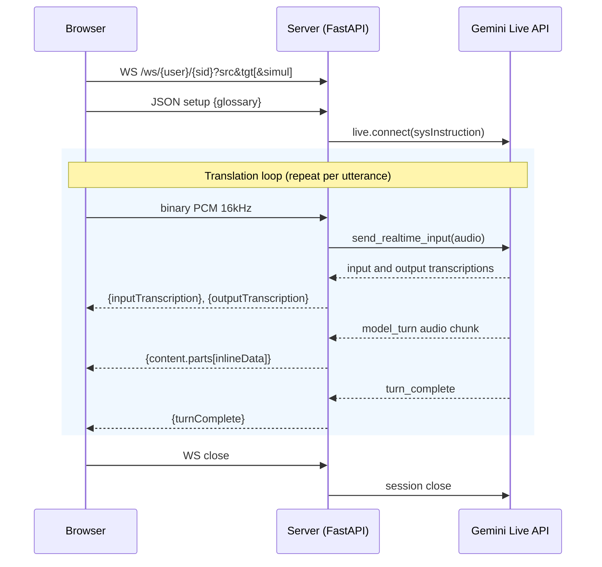

# Live Translator

Real-time audio translation powered by Gemini Live API. Speak in any language and hear the translation immediately. Three modes: agent mode (97 languages, glossary, voice replication), simultaneous translation mode (78 languages, auto-detect source language), and conversation mode (a bidirectional interpreter between two languages, so two people can talk to each other).


## Getting Started

### Prerequisites

- Python 3.10+
- [uv](https://docs.astral.sh/uv/) package manager
- [Gemini API key](https://aistudio.google.com/apikey)

### Setup

```bash
uv sync
```

Create `app/.env` with your API key:

```
GOOGLE_API_KEY=your-api-key
```

### Run

```bash
uv run uvicorn app.main:app --reload
```

Open http://localhost:8000.

## User Guide

### Basic Usage

1. Select source and target languages from the bottom bar
2. Click **Start** to begin continuous translation (always-on mode)
3. Speak into your microphone — translations appear as text bubbles and play as audio

### Simultaneous Translation

Toggle **Simul** to switch to simultaneous translation mode. This uses the `gemini-3.5-live-translate-preview` model which auto-detects the source language — the source language selector is hidden and only a target language dropdown is shown.

Differences from agent mode:
- **Auto-detect**: no need to select a source language
- **78 languages** supported (vs 97 in agent mode)
- **No glossary**: custom term pinning is not available
- **No voice replication**: the Voice Replication section is disabled in Voice & Audio settings
- **Idle timer**: since the model doesn't send turn-complete signals, transcription bubbles are finalized after 2 seconds of silence

Language selections are preserved when switching modes — codes are mapped automatically between the two language sets (e.g. `zh` ↔ `zh-Hans`).

### Conversation

Toggle **Conversation** to turn the one-way translator into a **bidirectional interpreter** between the two selected languages, so two people can hold a live conversation. The model auto-detects which of the two languages each utterance is spoken in and speaks the translation in the *other* one — e.g. with English + Japanese selected, English speech is rendered in Japanese and Japanese speech in English, in the same session.

Details:
- Both language selectors stay visible (unlike Simul); pick the two conversation languages.
- Uses the agent model (`gemini-3.1-flash-live-preview`) with a bidirectional interpreter system instruction. The **glossary applies in either direction**.
- A single output voice speaks both directions (the Live session has one voice config).
- **Mutually exclusive with Simul** — turning one on turns the other off.

### Push to Talk

Toggle **Push to Talk** on the right to switch from always-on to manual control. Hold the **Hold to Talk** button (or press spacebar) to transmit, release to stop.

### Audio Settings

Click **Audio** in the header to select which microphone and speaker to use. Choices are saved in your browser and applied on the next session.

### Glossary

Click **Glossary** in the header to pin specific terms to fixed translations. The glossary is per-browser (stored in `localStorage`) and sent to the server on each new session.

Upload a UTF-8 CSV with `source,target[,transcription]` per line:

```csv
Kubernetes,クバネティス,Kubernetes
Cloud Run,クラウドラン,Cloud Run
Vertex AI,バーテックスエーアイ,Vertex AI
```

The optional third column is a display override — the model pronounces the `target` form, but the on-screen transcript shows the `transcription` form. Useful for proper nouns where you want phonetic audio but a Latin display label.

Changes take effect on the next session (click **Start** again, or change languages).

#### Changing the default glossary

Edit `app/dict.csv` and redeploy. Browsers with a cached glossary keep using it until the user clicks **Reset to defaults** in the modal.

### Caption Overlay

Overlay translated subtitles on top of any window — useful for presentations at onsite events or screen sharing via Google Meet. Click **Caption** in the header to open the caption page, or navigate to `/caption` manually.


1. Open the main app in Chrome and click **Start** to begin translating
2. Click **Caption** in the header — a new window opens with a "Select Window" button
3. Click **Select Window** and pick the window to mirror (e.g. your slides, Keynote, or any app)
4. The selected window's content streams into the caption page with translated subtitles at the bottom
5. Share this caption window on Google Meet — participants see your slides with live subtitles

The caption page uses the [Screen Capture API](https://developer.mozilla.org/en-US/docs/Web/API/Screen_Capture_API) to mirror the target window and the [BroadcastChannel API](https://developer.mozilla.org/en-US/docs/Web/API/BroadcastChannel) to receive transcription from the main page, so both pages must run in the same browser. No OBS or third-party tools needed.

### Connection States

The status indicator in the top-right corner shows:
- **Yellow dot / Connecting...** — WebSocket connecting
- **Green dot / Connected** — ready to translate
- **Red dot / Disconnected** — connection lost, auto-reconnects in 5s

---

## Technical Details

### Sequence Diagram



FastAPI bridges one browser WebSocket to a series of Gemini Live API sessions. The browser WS lives for the lifetime of the user's tab; upstream Live sessions are opened, expire (~15 min), and reopened underneath it transparently.

**Connection lifecycle:**

1. Browser opens WebSocket to `/ws/{user_id}/{session_id}` and sends a JSON setup frame with the per-browser glossary
2. Server builds a system instruction embedding the glossary and language pair
3. Two background coroutines run concurrently:
   - **session_loop** opens a Gemini Live session, drains messages from it, and forwards them as JSON envelopes to the browser
   - **upstream_task** forwards binary audio frames from the browser WS to whichever upstream session is current
4. When the upstream session sends a GoAway (expiring in ~30s), the server immediately starts opening the next session in the background while continuing to drain the current one — this eliminates dead time between sessions
5. Once the old session finishes, the pre-opened session takes over seamlessly

**Wire format:** Each `LiveServerMessage` is translated into a camelCase JSON envelope the frontend understands (`turnComplete`, `inputTranscription`, `outputTranscription`, `content.parts[]`, `usageMetadata`).

**Transcription behavior:** Output transcription (the translated speech) streams in multiple partial chunks, so the UI can show word-by-word updates with a typing indicator. Input transcription (the user's spoken words) arrives as a single message with the complete text — the API does not stream partial input transcriptions, so the user's bubble appears all at once.

### Models

**Agent mode** uses `gemini-3.1-flash-live-preview` via the Gemini API (`generativelanguage.googleapis.com`). The system instruction (built in `app/translator_agent/agent.py`) tells the model to translate only the current utterance and never repeat previous translations. The glossary is embedded as `source → target` pairs with case-insensitive matching.

**Simultaneous translation mode** uses `gemini-3.5-live-translate-preview` with a `TranslationConfig` instead of system instructions. The config specifies `target_language_code` and `echo_target_language=True` (so the model echoes back what it hears in the target language). This model auto-detects the source language and does not support tools, glossary, or voice replication.

**Conversation mode** reuses the agent model (`gemini-3.1-flash-live-preview`) but with a bidirectional interpreter system instruction (`build_conversation_instruction` in `app/translator_agent/agent.py`): it tells the model to detect which of the two configured languages each utterance is in and reply in the other. The WebSocket carries a `convo=true` query param; the glossary is embedded bidirectionally (`source ↔ target`).

Audio input is 16 kHz mono PCM; output is 24 kHz PCM (both modes).

### GoAway Handling

Gemini Live API sessions expire after ~15 minutes. When the server receives a GoAway message:


1. A new session starts opening immediately in the background (`_open_next()`)
2. The old session continues draining — any in-progress translation completes and is forwarded to the browser
3. After the old session ends (or the GoAway deadline expires), the pre-opened session becomes the active session
4. Audio from the browser is routed to the new session with no gap

**Limitation:** If GoAway fires mid-utterance, the translation in progress may be lost. The model on the new session has no context from the previous session, so it starts fresh. In practice this affects ~1-2% of translations during long sessions.

Session resumption was intentionally removed — it caused an off-by-one translation cascade where the model would prepend the previous turn's translation to the current one. Without resumption, each session starts clean, which proved more reliable (98% pass rate vs 65% with resumption in 1-hour soak tests).

### Gemini Live API Transient Errors and Recovery

The Gemini Live API occasionally returns `1011 (service currently unavailable)` errors. Before the recovery fix, production logs showed ~20 errors per 24 hours in two patterns:

- **Mid-session kill** (~65% of cases): An active session is disconnected during `session.receive()`. The session was working, then Gemini drops it.
- **Connect-time rejection** (~35% of cases): Gemini refuses to open a new session entirely. This typically follows a mid-session kill — the retry fails because Gemini is still recovering.

These errors cascaded: a mid-session kill triggered a retry with a flat 1s delay, which was often also rejected because Gemini was still unavailable. The session connect call had no timeout, so it could hang indefinitely on unresponsive connections.

**Recovery logic in `session_loop`:**

1. **Connect timeout** (`CONNECT_TIMEOUT_SEC = 10`): The `conn.__aenter__()` call has a hard timeout so a hanging connect fails fast instead of blocking indefinitely.
2. **Exponential backoff**: Retries start at 0.2s and double on each consecutive failure, capping at 4s. The backoff resets after a successful session. This avoids thrashing the API while still recovering quickly from transient blips.
3. **Transparent reconnect**: The browser WebSocket stays open during retries — only the upstream Gemini session is affected. Once a new session opens, `upstream_task` resumes forwarding audio to it automatically.

After the fix, production logs showed 1 error in 15 hours (vs ~12 in the same period before), with zero connect-time rejections — the faster initial retry reconnects before the cascading failure pattern kicks in.

For real users streaming from a microphone, recovery is seamless — the new session picks up the live audio stream with a brief gap. For health checks that send a one-shot audio clip, the clip may be lost if the session dies before producing a response.

### SDK Note

`app/main.py` clears `GOOGLE_GENAI_USE_VERTEXAI`, `GOOGLE_CLOUD_PROJECT`, and `GOOGLE_CLOUD_LOCATION` before constructing the genai client. These env vars cause the SDK to route through `aiplatform.googleapis.com`; clearing them forces Gemini API key routing via `generativelanguage.googleapis.com`.

### Deployment to Cloud Run

```bash
set -a && source app/.env && set +a

gcloud run deploy live-translation \
  --source . \
  --project YOUR_PROJECT \
  --region us-central1 \
  --allow-unauthenticated \
  --timeout 3600 \
  --min-instances 1 \
  --max-instances 1 \
  --set-env-vars "GOOGLE_API_KEY=${GOOGLE_API_KEY}"
```

Key flags:
- `--timeout 3600` — allows hour-long WebSocket conversations (upstream Live sessions cycle internally every ~15 min)
- `--min-instances 1` — avoids cold start latency
- `--max-instances 1` — session resumption handles are stored in-memory; multi-replica requires a shared store (e.g. Redis)

## Testing

### Soak Test

`tests/test_long.py` validates translation quality, latency, glossary behavior, and session stability over extended periods (default 1 hour).

It generates random English sentences via Gemini Flash Lite, converts them to audio with Google Cloud TTS, streams them through the translator WebSocket, transcribes the returned audio with Google Cloud STT, and verifies semantic correctness.

```bash
uv sync --extra test

# 2-minute smoke test against local server
uv run python tests/test_long.py --duration 120

# 1-hour test against Cloud Run
uv run python tests/test_long.py --url wss://YOUR_CLOUD_RUN_URL --duration 3600
```

Options: `--url` (WebSocket base URL), `--duration` (seconds), `--source`/`--target` (language pair), `--log` (JSONL output path).

#### Latest soak test results (1 hour, en → ja, Cloud Run)

```
Duration: 3633s | Iterations: 198 | Passed: 198/198 (100.0%) | Avg score: 9.9/10 | Errors: 0

  Translation Score (n=198)
  min=8.00  avg=9.93  p50=10.00  p90=10.00  p99=10.00  max=10.00
         0-2:    0 (  0.0%) 
         3-4:    0 (  0.0%) 
         5-6:    0 (  0.0%) 
         7-8:    1 (  0.5%) 
        9-10:  197 ( 99.5%) ##############################

  Glossary Iteration Score (n=66)
  min=9.00  avg=9.95  p50=10.00  p90=10.00  p99=10.00  max=10.00
         0-2:    0 (  0.0%) 
         3-4:    0 (  0.0%) 
         5-6:    0 (  0.0%) 
         7-8:    0 (  0.0%) 
        9-10:   66 (100.0%) ##############################

  First Response (speech-end to first audio/transcript) (n=198)
  min=0.00  avg=0.04  p50=0.00  p90=0.07  p99=1.20  max=2.24
         =0s:  156 ( 78.8%) ##############################
      0-0.1s:   25 ( 12.6%) ####
    0.1-0.5s:   12 (  6.1%) ##
      0.5-1s:    3 (  1.5%) 
        1-2s:    1 (  0.5%) 
        2-5s:    1 (  0.5%) 
         >5s:    0 (  0.0%) 

  Turn Complete (speech-end to full translation) (n=197)
  min=3.50  avg=5.58  p50=5.51  p90=6.82  p99=8.12  max=9.47
         <2s:    0 (  0.0%) 
        2-3s:    0 (  0.0%) 
        3-4s:   13 (  6.6%) ##
        4-5s:   35 ( 17.8%) #######
        5-7s:  136 ( 69.0%) ##############################
       7-10s:   13 (  6.6%) ##
        >10s:    0 (  0.0%) 

  Input Transcription Score (n=198)
  min=5.00  avg=9.94  p50=10.00  p90=10.00  p99=10.00  max=10.00
         0-2:    0 (  0.0%) 
         3-4:    0 (  0.0%) 
         5-6:    1 (  0.5%) 
         7-8:    0 (  0.0%) 
        9-10:  197 ( 99.5%) ##############################

  Output Transcription Score (n=198)
  min=2.00  avg=9.54  p50=10.00  p90=10.00  p99=10.00  max=10.00
         0-2:    2 (  1.0%) 
         3-4:    0 (  0.0%) 
         5-6:    1 (  0.5%) 
         7-8:   20 ( 10.1%) ###
        9-10:  175 ( 88.4%) ##############################

  Total Iteration Time (n=198)
  min=13.39  avg=18.35  p50=18.08  p90=20.99  p99=23.89  max=45.31
        <10s:    0 (  0.0%) 
      10-15s:   10 (  5.1%) ##
      15-20s:  143 ( 72.2%) ##############################
      20-25s:   44 ( 22.2%) #########
      25-30s:    0 (  0.0%) 
        >30s:    1 (  0.5%) 
```

