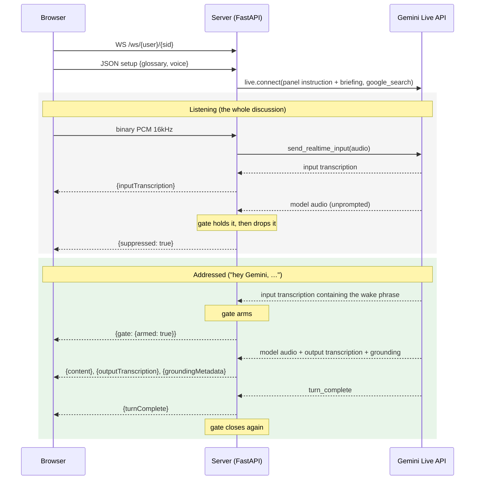
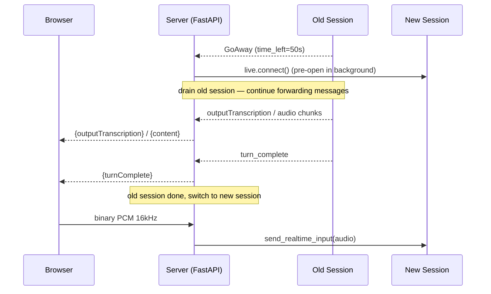
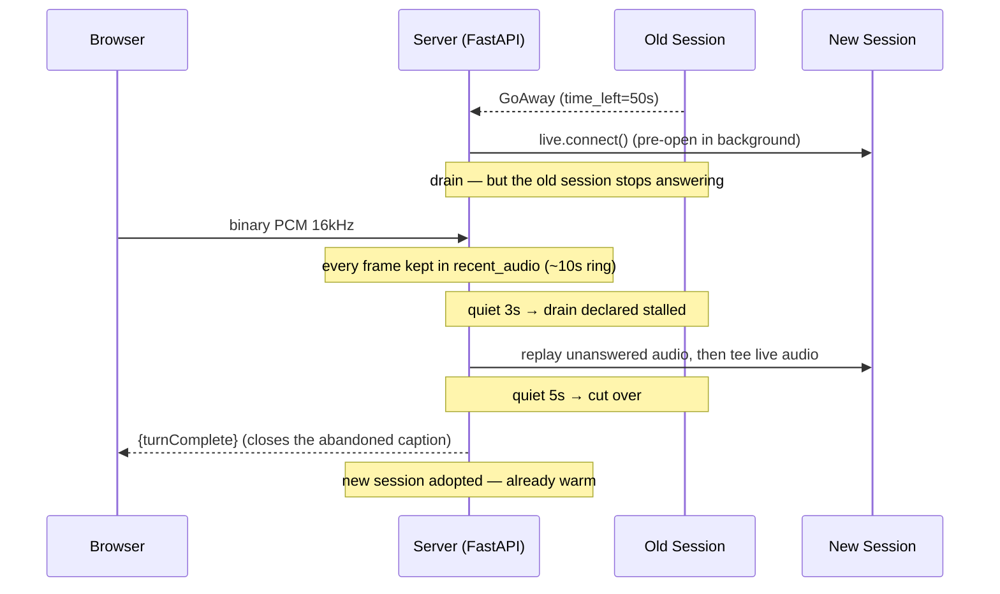

# AI Panel Assistant

An AI panellist for a live, on-stage discussion, powered by the Gemini Live API. It listens to the whole conversation and says nothing — until someone on the panel turns to it and says *"Hey Gemini, what do you think about…"*. Then it answers in the language it was asked in, using a research briefing prepared for the topic and Google Search for anything newer than that.

The topic it ships with is **AI and music**, and the briefing under `knowledge/ai-and-music/` is about 50 000 words of researched material on the litigation, the economics, the technology, the artists, and the Japanese scene.

## Getting Started

### Prerequisites

- Python 3.10+
- [uv](https://docs.astral.sh/uv/) package manager
- [Gemini API key](https://aistudio.google.com/apikey)

### Setup

```bash
uv sync
```

Create `app/.env` with your API key:

```
GOOGLE_API_KEY=your-api-key
```

### Run

```bash
uv run uvicorn app.main:app --reload
```

Open http://localhost:8000.

## User Guide

### Running a panel

1. Click **Start**, and allow microphone access when the browser asks.
2. Put the microphone where it can hear the panel — a table mic, a room mic, or the moderator's laptop.
3. Hold the discussion. The transcript builds on screen; the assistant stays silent.
4. When you want it in, say its name: *"Hey Gemini, what do you make of that?"*

Once you are running, **Start** turns into **Mute**. Muting stops sending audio but keeps the microphone ready, so unmuting is instant and the browser won't ask for permission again.

The pill in the header tells you which state it is in:

- **Listening** — hearing everything, saying nothing. This is the normal state and it is where the assistant spends the whole discussion.
- **Addressed — answering** (green) — a wake phrase landed and the next thing it says will be heard.
- **Armed — ask now** (green) — you pressed **Ask Gemini**; it is waiting for the question.
- **Asked for a topic** / **Answering typed question** (green) — the other two ways in.

A small **N held back** counter appears in the control strip when the assistant tried to answer something nobody asked it and the gate stopped the audio. Zero is the goal; a number here is worth looking at after the event, not during one.

### Getting its attention

Say the name with something that makes it an address rather than a mention:

| Works | Does not |
|---|---|
| "Hey Gemini, what do you think?" | "The Gemini API does that natively" |
| "Gemini, your take?" | "Suno and Gemini both do this" |
| "So Gemini, is that fair?" | "Gemini can generate stems" |
| 「ねえジェミニ、どう思う?」 | 「ジェミニのモデルは音楽も作れます」 |
| 「ジェミニさん、意見を聞かせてください」 | |

The bar is deliberately high. This panel will say the word *Gemini* as a product name all evening, and answering one of those means talking over a panellist in front of an audience. A missed wake phrase costs one repeated question; a false positive costs an interruption. So it errs towards silence — and there are two manual overrides for when it does:

- **Ask Gemini** — press it, then just ask your question out loud. No wake phrase needed. The gate stays open for 30 seconds, so pressing it and *then* speaking works.
- **Type a question** — the text box sends the question straight in. Useful when the room is loud, or when the moderator wants to line one up quietly.

### Suggest a topic

**Suggest a topic** asks the assistant for one question to put to the panel: something that would actually split the room, one sentence on why it is live right now, then it hands back to the moderator. It draws on the discussion prompts in its briefing but tailors them to what this panel has been arguing about in this session.

This is the only proactive thing it does, and it only does it when asked. It never volunteers a topic on its own.

### What its answers are like

The assistant is instructed to behave like a panellist rather than a search engine: three or four sentences, 20–40 seconds, concrete names and dates and numbers, an actual opinion followed by the strongest argument against it. It never reads a URL aloud — it names the source instead.

When an answer is grounded in Google Search, the sources appear under it along with Google's Search Suggestions chip. Both are required by Google's terms of service for grounded results, so they render whether or not you want them on screen.

### Voice & Audio Settings

Click **Voice & Audio** in the header to choose your microphone, your speaker, and the **voice** the assistant speaks in — 30 to pick from, each labelled with its character (`Charon — Informative`, `Sulafat — Warm`). All three are remembered by your browser.

Microphone and speaker changes take effect straight away. Changing the voice restarts the session, which clears the transcript.

The app remembers every microphone and speaker you have chosen, in order of preference, and always uses the best one currently plugged in. Unplug your headset mid-session and it drops to your next favourite rather than to whatever the system picks. Plug it back in and it takes over again. Choosing **System Default** clears the list — that is read as "stop managing this for me".

### Glossary

Click **Glossary** in the header. Here it is a **pronunciation guide**: names the assistant would otherwise mangle out loud. Your glossary is saved in your browser and applies only to you.

Upload a UTF-8 CSV with `source,target[,transcription]` per line:

```csv
Suno,スーノ,Suno
Udio,ユーディオ,Udio
JASRAC,ジャスラック,JASRAC
```

The third column is optional and only changes what you see: the app *says* the second form and *shows* the third. So `Suno,スーノ,Suno` is spoken as スーノ and written on screen as Suno.

Changes take effect next time the session starts — click **Start** again, or change the voice.

### Caption Overlay

Put the discussion transcript on top of any window — useful for an on-stage screen, or for screen sharing on Google Meet. Click **Caption** in the header, or go to `/caption`.


1. Open the main app in Chrome and click **Start**
2. Click **Caption** in the header — a new window opens with a "Select Window" button
3. Click **Select Window** and pick the window to mirror (your slides, Keynote, any app)
4. That window's content appears in the caption page, with subtitles along the bottom
5. Click **⛶ Fullscreen** in the top-right (or press **F**, or double-click) to fill the screen
6. Share this caption window on Google Meet — remote participants see the slides with live subtitles

Fullscreen is a separate click from *Select Window* on purpose; the two can't be combined for browser security reasons. The button appears once mirroring starts and fades after 4 seconds so it stays off your slides — move the mouse to bring it back. **Esc** exits, as does stopping the screen share.

Both windows have to be in the same browser, and it must be Chrome. No OBS or other tools are needed.

### Connection States

The dot in the top-right corner shows:
- **Yellow / Connecting…** — establishing the connection
- **Green / Connected** — listening
- **Red / Disconnected** — connection lost; it retries automatically after 5 seconds

### Echo and Feedback

**If you are on a phone, tablet, or laptop using its own built-in microphone and speakers, you can skip this section.** Your device cancels its own echo, and the app leaves that switched on. The same goes for headphones or an ordinary headset.

You may run into trouble if you are doing any of the following:

- Sending sound to a speaker other than **System Default** in Voice & Audio
- Using a PA system, external speakers, or a mixing desk — which is exactly what an on-stage panel uses
- Working in a large or echoey room, or with a distant speaker

In those setups the assistant's answer comes out of the speakers and the panel microphones hear it. It will not build into a runaway loop the way a translator does — the assistant is silent by default and the [output gate](#the-output-gate) drops anything it says unprompted — but it can mistake its own returning voice for a panellist addressing it, and it clutters the transcript.

If you hear an echo, try these in order:

1. **Put on headphones**, or route the assistant to a monitor the panel mics do not face.
2. **Set the speaker back to System Default** in Voice & Audio. Sending audio anywhere else switches off the browser's echo cancellation — this is the most common cause of bad echo.
3. **Turn the volume down**, or move the microphone further from the speakers.
4. **Push to Talk** — the microphone only listens while the button is held, so nothing reaches it between questions. Reach for this in a genuinely hostile room; it also means the assistant stops hearing the discussion, so it loses the context its answers draw on.

Playing the audio through a PA system or a mixing desk defeats echo cancellation completely, because the sound never goes through this browser.

---

## The knowledge base

`knowledge/ai-and-music/` holds ten Markdown files, researched for this panel:

| File | What is in it |
|---|---|
| `00-index.md` | Orientation, a routing table, the 20 facts worth citing, and a 28-term glossary |
| `01-generative-music-landscape.md` | The tools, the companies, the model families |
| `02-law-copyright-litigation.md` | The lawsuits, the rulings, the licensing settlements |
| `03-industry-economics-platforms.md` | Streaming payouts, catalogue value, platform policy |
| `04-artists-practice-backlash.md` | What working musicians are doing and refusing to do |
| `05-technical-foundations.md` | How the models work, and where they fail |
| `06-performance-tools-cocreation.md` | Live performance, DAW integration, co-creation |
| `07-culture-authorship-labor.md` | Authorship, labour, and the cultural argument |
| `08-japan-asia-scene.md` | JASRAC, the Japanese copyright exception, the regional scene |
| `09-discussion-prompts.md` | Provocations, escalation ladders, devil's-advocate lines |

Every file carries external links, so the briefing is also a reading list for the human panellists.

**How it reaches the model.** At import time the files are digested into a single briefing that goes into the system instruction. That instruction is re-sent on every upstream session reopen — roughly every nine minutes — so its size is a real running cost, not a one-off. `PANEL_KNOWLEDGE_MAX_CHARS` (default 100 000) caps it. `00-index.md` and `09-discussion-prompts.md` go in as whole as the budget allows, because they are what the assistant reasons over; the topic files are cut down to their highest-priority sections, always on a heading boundary so no fact arrives half-stated. The current briefing is about 93 000 characters — check yours at `/api/config`.

**Changing the topic.** Point `PANEL_KNOWLEDGE_DIR` at a different folder of `.md` files and set `PANEL_TOPIC` to match. Nothing else in the app is music-specific except the wake matcher's tolerance for the word *Gemini*, which is topic-independent.

| Env var | Default | What it does |
|---|---|---|
| `PANEL_TOPIC` | `AI and music` | Named in the system instruction and the UI |
| `PANEL_ASSISTANT_NAME` | `Gemini` | The name it answers to |
| `PANEL_ASSISTANT_NAME_JA` | `ジェミニ` | The same, for Japanese wake phrases |
| `PANEL_KNOWLEDGE_DIR` | `knowledge/ai-and-music` | Folder of `.md` files to brief from |
| `PANEL_KNOWLEDGE_MAX_CHARS` | `100000` | Briefing budget |
| `PANEL_MODEL` | `gemini-3.1-flash-live-preview` | Live model |
| `PANEL_VOICE` | `Charon` | Default voice, before the browser's own choice |
| `PANEL_WAKE_PATTERNS` | — | Newline-separated regexes, replacing the built-in list. A live event is the wrong place to discover that a speaker's accent defeats the defaults, so this is tunable from the deploy command |

---

## Technical Details

### Sequence Diagram



FastAPI bridges one browser WebSocket to a series of Gemini Live API sessions. The browser WS lives for the lifetime of the tab; upstream Live sessions are opened, expire, and are reopened underneath it transparently.

1. Browser opens a WebSocket to `/ws/{user_id}/{session_id}` and sends a JSON setup frame with the per-browser glossary and voice
2. Server builds a system instruction from the panel persona, the glossary, and the knowledge briefing
3. Two background coroutines run concurrently:
   - **session_loop** opens a Gemini Live session, drains messages, and forwards them as JSON envelopes through the gate to the browser
   - **upstream_task** forwards binary audio frames from the browser to whichever upstream session is current
4. Text frames from the browser are control messages, not audio: `{"type":"arm"}`, `{"type":"disarm"}`, `{"type":"topic"}`, `{"type":"ask","text":…}`

**Wire format:** each `LiveServerMessage` becomes a camelCase JSON envelope (`turnComplete`, `inputTranscription`, `outputTranscription`, `content.parts[]`, `groundingMetadata`, `usageMetadata`), plus two the server originates itself: `{"gate":{"armed",…}}` and `{"suppressed":true}`.

### The output gate

The Live API has no "listen but do not speak" mode. `proactive_audio` — which would be the right tool — is not supported on `gemini-3.1-flash-live-preview`. So the model hears the entire discussion and forms an opinion about all of it, and the silence is enforced on the way out.

`OutputGate` in `app/main.py` buffers every envelope carrying model output. If the turn was armed, the buffer flushes and the room hears the answer. If it ends unarmed, the buffer is discarded and the room hears nothing.

Four details are load-bearing:

- **Buffering rather than discarding on arrival.** The wake phrase and the first audio chunk can land in the same batch from the API. Discarding as they arrive would clip the first syllable off every answer; buffering means the arm can retroactively release output that was already in hand. The gate test measures this: 3 of 3 chunks released.
- **A cap on the buffer.** `GATE_BUFFER_MAX_BYTES` (200 KB) is several seconds of unrequested speech. Past that, the turn is written off and the rest of it is dropped rather than held — there is no plausible arm left in a turn that long.
- **The silent keys ride separately.** Input transcription and `turnComplete` can share an envelope with the reply being held. They make no sound, they drive the captions, and the client needs the boundary to close out the turn, so the gate splits them off and forwards them even as it drops the audio they arrived with.
- **The gate closes at the end of the answered turn.** Otherwise one wake phrase turns the assistant on for the rest of the evening — the failure that is worst on stage and least visible in a short test. `tests/test_gate.py` pins it: one answer per question.

A manual arm (`arm_manual`) works differently from a wake-phrase arm, because the moderator presses the button and *then* speaks. It has a wall-clock TTL (`MANUAL_ARM_TTL_SEC`, 30 s) so it survives the turn boundary between the press and the question, and it clears as soon as a turn actually produces speech.

### Wake-phrase detection

`WakeMatcher` in `app/panel_agent/agent.py`. Matching the bare name is not an option on a panel that discusses Gemini as a product, so a match requires the name **plus evidence of direct address**:

- a vocative cue in front of it — `hey|hi|hello|ok|alright|yo`, 「ねえ」「へい」「おい」, or the weaker `so|and|now|well|but`
- an address marker behind it — a comma, a question mark, the end of the utterance, an honorific 「さん」, or a second-person question opening (`what|how|do you|can you|your take|どう思|教えて|…`)

The two strengths differ in what they will accept behind the name: a strong cue accepts a full stop and the end of the utterance ("Let's ask Gemini."), a weak one does not, because "Suno and Gemini." is a list rather than a hand-off. `can you` is matched rather than bare `can`, so "Gemini can generate stems" is a statement about the product and "Gemini, can you explain" is a question to the panellist.

Text is normalised before matching (NFKC, case-folded, full-width punctuation mapped) and eight spellings of the name are accepted, because speech recognisers return *gemani*, *jemini*, 「ジェミナイ」 as readily as the right one.

Matching runs against **two strings**, and needs both. The turn's own text gives `^`-anchored patterns a clean anchor. A rolling 400-character window spanning turn boundaries catches a phrase the voice-activity detector split down the middle, leaving "Hey Gemini" in one turn and the question in the next. After a turn, only the last 60 characters of the window are kept — carrying a whole turn lets the end of one sentence sit next to the start of the next and form a phrase neither speaker said.

`tests/test_wake.py` has 73 cases, and the negatives are the point of it.

### Models and tools

`gemini-3.1-flash-live-preview` via the Gemini API (`generativelanguage.googleapis.com`), with `google_search` attached as a tool and AUDIO as the output modality. Audio input is 16 kHz mono PCM; output is 24 kHz PCM.

Grounding metadata comes back on the same `server_content` as the answer and is forwarded to the browser, which renders the Search Suggestions chip from `searchEntryPoint` as delivered and lists the source chunks. Google's terms require both for grounded results.

Typed questions and topic requests are injected with `send_realtime_input(text=…)` — mid-conversation text injection, which Gemini 3.1 supports — wrapped in a bracketed frame (`[A panellist is asking you directly, in text: …]`) so the model can tell an out-of-band instruction from something a panellist said in the room.

### Audio Devices and Voices

Microphone and speaker choices build a **priority list** rather than a single setting, stored in `localStorage`. Each device picked moves to the top of its list (up to 10 remembered), and the app uses the highest-ranked device actually attached. On `devicechange` the list is re-evaluated and the running pipeline switches mid-session, so losing the mic in use drops to the next favourite instead of the system default. Choosing **System Default** is a deliberate opt-out and clears the list.

Each entry stores **both `deviceId` and label**. A `deviceId` is perishable — the browser re-salts it when site permissions are cleared, and some devices return with a new one after a replug — so if the saved id no longer resolves, the device is matched by name and the stored id is repaired in place, keeping its rank.

The voice is part of the Live session's config, so changing it requires a reconnect (which clears the transcript); microphone and speaker changes do not. Unknown voice names sent by a client are rejected server-side, since the Live API refuses to connect on an unrecognised voice.

### Caption Overlay Internals

The caption page uses the [Screen Capture API](https://developer.mozilla.org/en-US/docs/Web/API/Screen_Capture_API) to mirror the target window and the [BroadcastChannel API](https://developer.mozilla.org/en-US/docs/Web/API/BroadcastChannel) (channel `ai-panel`) to receive transcription from the main page, so both pages must run in the same browser.

Fullscreen needs its own click, separate from *Select Window*: `requestFullscreen()` consumes the transient user activation that `getDisplayMedia()` also requires, and the window picker preempts an in-flight fullscreen transition. Hence the dedicated button, which appears once mirroring starts and fades out after 4 seconds.

### Changing the Default Glossary

Edit `app/dict.csv` and redeploy. The glossary is per-browser (`localStorage`) and sent to the server on each new session, so browsers with a cached glossary keep using it until the user clicks **Reset to defaults** in the modal.

### GoAway Handling

Gemini Live sessions do not last indefinitely. In 30-minute soaks a GoAway arrived every ~9 minutes, always with `time_left=50s`. When the server receives one:



1. A new session starts opening immediately in the background (`_open_next()`), ready in ~200 ms
2. The old session continues draining — any answer in progress completes and is forwarded
3. After the old session ends, the pre-opened session becomes active
4. Audio from the browser is routed to the new session with no gap

A drain that never finishes its turn is the awkward case: waiting out the whole 50 s deadline is dead air. Two thresholds bound it, both measured from the last frame actually forwarded to the browser (heartbeats don't count, so a turn genuinely in flight is never clipped):



5. At `DRAIN_MIRROR_QUIET_SEC` (3 s of quiet) the drain is treated as stalled and the microphone is teed into the replacement as well — speech going into a session that has stopped answering still reaches one that hasn't
6. At `GOAWAY_IDLE_GRACE_SEC` (5 s of quiet) the swap happens rather than waiting out the deadline. The abandoned turn will never report itself complete, so the server sends a synthetic `turnComplete` to close the caption the client left open
7. If a mirrored drain recovers and completes its turn after all, the replacement is discarded and a fresh one opened — it heard audio the old session went on to answer, so keeping it would mean answering the same question twice

What gets replayed into a replacement is decided by one rule: **the audio captured since the outgoing session last said anything.** `recent_audio` keeps every mic frame with its arrival time for ~10 s so the cut can be made at that boundary rather than at a fixed offset. This also covers a GoAway that lands mid-sentence on a session that had already been quiet for longer than the grace: the cutover happens within milliseconds, the mirror never attaches, but the sentence so far is handed to the replacement the moment it is adopted.

**What it costs the room.** Across 11 GoAways observed in soak testing — measured on the live-translation app this repo grew out of, where every utterance demanded an answer and the seam was therefore maximally visible — a GoAway takes one of four paths:

| Path | Observed | Effect |
|---|---|---|
| Old session finishes its turn | — | none — the swap happens between turns, mic audio keeps flowing to the dying session throughout |
| Drain stalls, then recovers and completes its turn | 5 | none. The mirrored replacement heard audio the old session went on to answer, so it is discarded and a fresh one opened (~190 ms, off the critical path) |
| Drain stalls and never recovers | 3 | up to 5 s of delay, in a window where nothing was being delivered anyway. The mirror means the replacement has been working on that audio for the last 2 s, so it flushes shortly after the swap rather than starting cold |
| GoAway lands mid-sentence on an already-quiet session | 3 | cutover in 2–4 ms, the sentence so far (1.4–3.5 s of audio) replayed 83–197 ms later. Before the replay was added, all but the last word of that sentence was lost |

A gated panel assistant is far more forgiving than that: it is silent for almost every turn, so most GoAways land in a window where nothing is owed to anyone. The exposure is the seam falling inside the one turn in twenty where it is actually answering.

**Watch out for turn accounting.** The synthetic `turnComplete` is a turn boundary with no turn behind it. Anything pairing utterances 1:1 with turn boundaries over a long-lived socket will sit one turn behind for the rest of the connection once a cutover happens. `tests/test_long.py` flushes frames belonging to a turn it gave up on and rejects a boundary with no content in front of it; the browser client is unaffected because finalising an already-closed caption is a no-op.

**Limitations:**

- The model on the new session has no context from the previous one. The replay covers the audio, not the history — so a session swap costs the assistant its memory of the discussion so far, and only the briefing survives. This is the largest known gap for a long panel.
- On the cutover paths, mic audio arriving between the cutover and the adoption of the replacement (83–197 ms observed) is still dropped.

Session resumption was intentionally removed — it caused an off-by-one cascade where the model prepended the previous turn's output to the current one.

### Gemini Live API Transient Errors and Recovery

The Live API occasionally returns `1011 (service currently unavailable)`. An hour-long Cloud Run soak also recorded `1008 (policy violation) The operation was aborted.` 31 times; the recovery path does not branch on the close code, so it handles both, and 30 of those 31 never reached a client.

Two patterns account for the failures: a **mid-session kill** (~65%), where an active session is disconnected during `session.receive()`, and a **connect-time rejection** (~35%), which typically follows one — the retry fails because Gemini is still recovering.

**Recovery logic in `session_loop`:**

1. **Connect timeout** (`CONNECT_TIMEOUT_SEC = 10`) so a hanging connect fails fast instead of blocking indefinitely.
2. **Exponential backoff**: retries start at 0.2 s and double, capping at 4 s, resetting after a successful session.
3. **Transparent reconnect**: the browser WebSocket stays open during retries — only the upstream session is affected.
4. **No deadlock on the retry path**: `next_ready` is set only by the GoAway pre-open, so waiting on it after a session error parked the loop forever. The wait is gated on an `open_pending` flag that the error path clears.

After the fix, production logs showed 1 error in 15 hours (vs ~12 in the same period before), with zero connect-time rejections.

### SDK Note

`app/main.py` clears `GOOGLE_GENAI_USE_VERTEXAI`, `GOOGLE_CLOUD_PROJECT`, and `GOOGLE_CLOUD_LOCATION` before constructing the genai client. These env vars route the SDK through `aiplatform.googleapis.com`; clearing them forces Gemini API key routing via `generativelanguage.googleapis.com`.

### Deployment to Cloud Run

```bash
set -a && source app/.env && set +a

gcloud run deploy ai-panel \
  --source . \
  --project YOUR_PROJECT \
  --region us-central1 \
  --allow-unauthenticated \
  --timeout 3600 \
  --min-instances 1 \
  --max-instances 1 \
  --set-env-vars "GOOGLE_API_KEY=${GOOGLE_API_KEY},LOG_LEVEL=INFO"
```

The `Dockerfile` copies `knowledge/` into the image, so the briefing ships with the service.

Key flags:
- `LOG_LEVEL=INFO` — the app defaults to `DEBUG`, which makes the `websockets` client log the whole Live API handshake, `x-goog-api-key` header included. On Cloud Run that goes to Cloud Logging.
- `--timeout 3600` — a panel runs longer than the default WebSocket timeout allows
- `--min-instances 1` — avoids cold start latency
- `--max-instances 1` — session state is in-memory; multi-replica requires a shared store

#### Deploying to more than one region

Cloud Run services are regional, so the same command with a different `--region` gives a second independent endpoint under the same service name:

```bash
gcloud run deploy ai-panel --source . \
  --project YOUR_PROJECT --region asia-northeast1 \
  --allow-unauthenticated --timeout 3600 \
  --min-instances 1 --max-instances 1 \
  --set-env-vars "GOOGLE_API_KEY=${GOOGLE_API_KEY},LOG_LEVEL=INFO"
```

What this buys you: the relay moves closer to the room, which cuts the browser↔server leg of every audio frame — worth having for an event in Japan. What it does not: the server↔Gemini leg is unaffected, because routing goes through `generativelanguage.googleapis.com` regardless of where the container runs. Each region keeps its own in-memory state, so a client must stay on one endpoint for the length of a discussion. Pick the region per event rather than load-balancing across both.

One deployment note. `LOG_LEVEL=INFO` silenced the `x-goog-api-key` handshake dump on a new revision immediately — but the *previous* revision kept logging it for roughly 30 minutes after cutover, because `--min-instances 1` plus `--timeout 3600` keeps an old container alive draining long-lived WebSocket connections. A deploy that fixes a logging leak does not stop the leak at the moment traffic switches.

## Testing

Four of the five suites are offline — no server, no API key, no audio — and run in under a second between them. Run those first.

```bash
uv run python tests/test_wake.py      # 73 cases: what does and does not count as being addressed
uv run python tests/test_gate.py      # 23 cases: what the room actually hears
uv run python tests/test_glossary.py  #  8 cases: fragment-boundary term replacement
```

### Wake-phrase test

`tests/test_wake.py` replays utterances through `WakeMatcher`. The negatives are the reason it exists: every way this panel will say "Gemini" without meaning to summon it — "the Gemini API", "Suno and Gemini both", "we built it on Gemini", 「ジェミニのモデルは」 — is pinned as a non-match, alongside the positives in both languages and the fragment-split cases.

### Gate test

`tests/test_gate.py` replays the exact envelope sequence `_relay_session` would hand the gate, with a hand-cranked clock so the manual-arm timeout is testable without sleeping. It covers the default silence, a product mention, a wake phrase, output that arrived before the arm, buffer overflow, the manual arm and its expiry, one-answer-per-question, and a held reply not swallowing the turn boundary it arrived with.

### Glossary test

`tests/test_glossary.py` replays recorded and synthetic transcription fragment sequences through `_TranscriptRewriter` and asserts the text the browser ends up with. Gemini splits transcription aggressively — `クバネティス` was observed arriving as `をク` + `バネティ` + `スに`, with no fragment containing the term — so replacement has to buffer across fragment boundaries.

### E2E Test

`tests/test_e2e.py` speaks into a live session with macOS `say`, streams the audio over the WebSocket, and judges the reply. Every case states an expectation in **both** directions, because a build that answers everything would pass any test that only checks whether a reply came back.

- **Four silence cases** — ordinary discussion, its own name as a product name, a Japanese product mention, and a question aimed at a human panellist by name.
- **Five answering cases** — English wake phrase, Japanese wake phrase answered in Japanese, name-first with no cue word, a question the briefing already covers, and one that can only be answered by search (which then has to arrive with its sources).
- **Three control cases** — the Ask button, Suggest a topic, and a typed question.
- **One two-turn case** — a question, then ordinary discussion. The second turn must be silent, which is what proves the gate closes again.

Audio is judged by level, not frame count: a model declining to speak still streams frames, they are just digital silence. "Spoke" means at least three frames above RMS 50 on a 32768 scale.

```bash
uv run python tests/test_e2e.py                       # every case
uv run python tests/test_e2e.py --match "Japanese"    # one case
uv run python tests/test_e2e.py --say en "Hey Gemini, what is Suno?" --expect en
```

Options: `--url` (default `ws://localhost:8000`), `--match`, `--say LANG TEXT`, `--expect`. Requires macOS (`say`) and `ffmpeg`.

### Soak Test

`tests/test_long.py` drives a synthetic panel discussion over one long-lived WebSocket for an hour, which is what exercises the GoAway cycle. It generates each line with Gemini Flash Lite, speaks it with Cloud TTS in one of three rotating voices, and measures two things:

- **False-speak rate** — turns it answered that nobody addressed to it. Every one is the assistant talking over a panellist in front of an audience. Any false speak fails the run.
- **Miss rate** — questions it was asked and did not answer. Costs one repeated question.

Three turns of ordinary discussion per question, and every third distractor drops the assistant's name as a product name, because that is the hard case. Chatter and name-drops are reported separately. Answers are graded by Flash Lite as a *panel contribution* — vagueness and padding score low even when the answer is correct — and latency is reported from the end of the panellist's speech.

```bash
uv sync --extra test

uv run python tests/test_long.py --duration 120                          # smoke test
uv run python tests/test_long.py --url wss://YOUR_URL --duration 3600    # full hour
```

Options: `--url`, `--duration` (seconds), `--log` (JSONL output path).

Each run writes a `.report` alongside its JSONL. `tests/chart_soak.py` draws those distributions as bar charts, one run or several side by side:

```bash
uv run python tests/chart_soak.py soak_panel.report
uv run python tests/chart_soak.py local.report prod.report --labels local prod \
  --metrics "Answer Score" "Answer Complete"
```

Testing against `wss://` from macOS may fail with `CERTIFICATE_VERIFY_FAILED` if the Python framework build has no CA bundle. Point it at certifi's: `export SSL_CERT_FILE=$(uv run python -c "import certifi;print(certifi.where())")`.
